# Kubernetes 1.4 基础课程

##### kissingwolf@gmail.com

[TOC]

## Kubernetes 介绍

### Kubernetes的发展历史

Kubernetes是一个开源的用于管理大量异构主机组成的云平台中容器的应用，Kubernetes的目标是让部署容器化的应用及微服务简单且高效。Kubernetes提供了应用部署、规划、更新和维护的软件集合，它的核心特点之一就是保证云平台中的容器按照用户的期望自动化的运行，云平台管理人员仅仅需要加载一个微型服务，规划器会自动找到合适的位置高可用的运行这个微服务。

在Docker作为高级容器引擎快速发展的之前，Google很早就致力于容器技术及集群方面的积累。在Google内部容器技术已经应用了很多年，Borg系统运行管理着成千上万的Google内部容器应用和微服务，在Borg的支持下，无论是谷歌搜索，还是Gmail，以及谷歌地图和YouTube视频，都可以从庞大的数据中心中自动化的获取技术资源来支撑其服务高性能且稳定的运行。Borg项目是Kubernetes项目的前身，Kubernetes正是在Borg的基础上发展、构建、创新而来的。

作为集群管理器出现的Borg系统，在其系统中运行着众多集群，而每个集群又由上万台服务器联接组成，Borg每时每刻都在处理来自众多应用程序所提交的成百上千的工作请求（Job）， Borg对这些工作请求（Job）进行接收、调度、启动，并对服务器上的容器进行启动、关闭、释放和监控。Borg论文中提到的三大优势:

* 为终端用户隐藏环境部署、资源管理和错误处理过程，终端用户仅需要关注应用的开发。 
* 全局服务高可用、高可靠和性能监控。
* 自动化的将负载到成千上万的异构的服务器组成的集群中。

Kubernetes于2014年6月在旧金山发布，其在希腊语中意思是船长或领航员，这也与它在容器集群管理中的角色吻合，即作为装载了集装箱（Container）的众多货船的指挥者，负担着全局调度和运行监控的职责。Kubernetes也经常写作k8s，8代表从k到s有“ubernete”8个字符。

Kubernetes对云环境中的资源进行了更高层次的抽象，通过将容器进行细致的组合，将最终的应用服务交给用户。Kubernetes在模型建立之初就考虑了容器在异构服务器上连接的要求，支持多种网络解决方案，并可以在服务层面上构建集群范围的软件定义网络（SDN）环境。其目的是将服务发现和负载均衡机制放置到容器可达的范围内，这种透明的方式便利了各个服务之间的通信，并为微服务架构提供了平台基础。

Kubernetes于2015年7月发布了1.0版本，在2016年10月发布了1.4版本。新的1.4版本的Kubernetes更加简单高效，并且支持了最新的Docker 1.12中的新功能。

### Kubernnetes 是什么

Kubernetes是一种用于容器集群的自动化部署、扩容以及运维的开源平台。与其竞争的容器集群管理开源平台还包括Mesos这样的重量级产品。

使用Kubernetes可以快速高效地响应客户需求，其特点如下：

* 动态地对应用进行扩容。
* 无缝地发布和更新应用程序及服务。
* 按需分配资源以优化硬件使用。

Kubernetes的出现是为了减轻系统运维人员在公有云及私有云上编配和运行应用的负担。

Kubernetes从开发之初就致力于将其打造为简洁、可移植、可扩展且可自愈的系统平台，具体说明如下：

* 简洁：轻量级，简单，易上手
* 可移植：公有，私有，混合，多重云（multi-cloud）
* 可扩展: 模块化, 插件化, 可挂载, 可组合
* 可自愈: 自动布置, 自动重启, 自动复制
* 以应用程序为中心的管理： 将抽象级别从在虚拟硬件上运行操作系统上升到了在使用特定逻辑资源的操作系统上运行应用程序。这在提供了Paas的简洁性的同时拥有IssS的灵活性，并且相对于运行[12-factor](http://12factor.net/)应用程序有过之而无不及。
* 开发和运维的关注点分离: 提供构建和部署的分离；这样也就将应用从基础设施中解耦。
* 敏捷的应用创建和部署: 相对使用虚拟机镜像，容器镜像的创建更加轻巧高效。
* 持续开发，持续集成以及持续部署: 提供频繁可靠地构建和部署容器镜像的能力，同时可以快速简单地回滚(因为镜像是固化的)。
* 松耦合，分布式，弹性，自由的微服务: 应用被分割为若干独立的小型程序，可以被动态地部署和管理 -- 而不是一个运行在单机上的超级臃肿的大程序。
* 开发，测试，生产环境保持高度一致: 无论是再笔记本电脑还是服务器上，都采用相同方式运行。
* 兼容不同的云平台或操作系统上: 可运行与Ubuntu，RHEL，on-prem或者Google Container Engine，覆盖了开发，测试和生产的各种不同环境。
* 资源分离: 带来可预测的程序性能。
* 资源利用: 高性能，大容量。

### Kubernetes 不是什么

Kubernetes不是平台即服务（PaaS）。

* Kubernetes并不对支持的应用程序类型有任何限制。 它并不指定应用框架，限制语言类型，也不仅仅迎合 [12-factor](http://12factor.net/)模式. Kubernetes旨在支持各种多种多样的负载类型：只要一个程序能够在容器中运行，它就可以在Kubernetes中运行。
* Kubernetes并不关注代码到镜像领域。它并不负责应用程序的构建。不同的用户和项目对持续集成流程都有不同的需求和偏好，所以Kubernetes分层支持持续集成但并不规定和限制它的工作方式。
* 确实有不少PaaS系统运行在Kubernetes之上，比如[Openshift](https://github.com/openshift/origin)和[Deis](http://deis.io/)。同样你也可以将定制的PaaS系统，结合一个持续集成系统再Kubernetes上进行实施：只需生成容器镜像并通过Kubernetes部署。
* 由于Kubernetes运行再应用层而不是硬件层，所以它提供了一些一般PaaS提供的功能，比如部署，扩容，负载均衡，日志，监控，等等。无论如何，Kubernetes不是一个单一应用，所以这些解决方案都是可选可插拔的。

Kubernetes并不是单单的"编排系统"；它排除了对编排的需要:

* “编排”的技术定义为按照指定流程执行一系列动作：执行A，然后B，然后C。相反，Kubernetes有一系列控制进程组成，持续地控制从当前状态到指定状态的流转。无需关注你是如何从A到C：只需结果如此。这样将使得系统更加易用，强大，健壮和弹性。


### Kubernetes的组织结构

Kubernetes组织结构主要是由Node、Pod、Replication Controller、Deployment、Service等多种资源对象组成的。其资源对象属性均保存在etcd提供的键值对存储库中，通过kubectl工具完成对资源对象的增、删、查、改等操作。我们可以将Kubernetes视为一个高度自动化的资源对象控制系统，它通过跟踪和对比etcd键值对库中保存的“对象原始信息”和当前环境中“对象实时信息”的差异来实现自动化控制和自动化纠错等功能的。

Kubernetes支持[Docker](http://www.docker.io/)和[Rocket](https://coreos.com/blog/rocket/)容器, 对其他的容器镜像格式和容器会在未来加入。

#### Master

Kubernetes中的Master是一台运行Kubernetes的主机，可以是物理机也可以是虚拟机，它是Kubernetes集群中的控制节点，它负责完成整个Kubernetes集群的创建、管理和控制，在Kubernetes集群中必不可少。

我们默认只能在Master上使用kubectl工具完成Kubernetes具体的操作命令，如果Master宕机或是离线，我们所有的控制命令都会失效。因此Master非常重要，在生产环境中，Master一般会配置高可用集群服务解决其单点故障问题。

Kubernetes 1.4 开始Master上的关键服务都是以Docker 容器实例的方式运行的，包括etcd服务。具体服务和其功能如下：

* Kubernetes API Server （ kube-apiserver），为kubernetes客户端提供HTTP Rest API接口的关键服务，是kubernetes中对象资源增、删、查、改等操作的唯一入口，同时也是kubernetes集群控制的入口。
* Kubernetes Controller Manager （ kube-controller-manager），为Kubernetes提供统一的自动化控制服务。
* Kubernetes Scheduler （kube-scheduler），为Kubernetes提供资源调度的服务，统一分配资源对象。
* Etcd Server（etcd），为Kubernetes保存所有对象的键值对数据信息。

#### Node

在Kubernetes集群中，除了Master之外其它运行Kubernetes服务的主机称之为Node，在早期Kubernetes中称其为Minion。Node也可以是物理机或虚拟机。Node是Kubernetes集群中任务的负载节点，Master经过特殊设置后也可以作为Node负载任务。Kubernetes一般是由多个Node组成的，我们建议Node的数量是N+2的。当某个Node宕机后，其上的负载任务将会被Master自动转移到其它的Node上。之所以使用N+2的配置，是为了在Node意外宕机时Kubernetes集群的负载不会突然被撑满，导致性能急剧下降。

Kubernetes 1.4 开始Node上的关键服务都是以Docker 实例的方式运行的，具体服务和功能如下：

* kubelet，负责Pod对应的容器实例的创建、启动、停止、删除等任务，接受Master传递的指令实现Kubernetes集群管理的基本功能。
* kube-proxy，实现kubernetes service功能和负载均衡机制的服务。

Node节点通过kubelet服务向Master注册，可以实现动态的在Kubernetes集群中添加和删除负载节点。已加入Kubernetes集群中的Node节点还会通过kubelet服务动态的向Master提交其自身的资源信息，例如主机操作系统、CPU、内存、Docker版本和网络情况。如果Master发现某Node超时未提交信息，Node会被判定为“离线”并标记为“不可用（Not Ready），随后Master会将此离线Node上原有Pod迁移到其它Node上。


#### Pod

在Kubenetes中所有的容器均在Pod中运行，一个Pod可以承载一个或者多个相关的容器。同一个Pod中的容器会部署在同一个物理机器上并且能够共享资源。一个Pod也可以包含0个或者多个磁盘卷组（volumes），这些卷组将会以目录的形式提供给一个容器或者被所有Pod中的容器共享。对于用户创建的每个Pod，系统会自动选择那个健康并且有足够资源的机器，然后开始将相应的容器在那里启动，你可以认为Pod就是虚拟机。当容器创建失败的时候，容器会被节点代理（node agent）自动重启，这个节点代理（node agent）就是kubelet服务。在我们定义了副本控制器（replication controller）之后，如果Pod或者服务器故障的时候，容器会自动的转移并且启动。

Pod是Kubernetes的基本操作单元，把相关的一个或多个容器构成一个Pod，通常Pod里的容器运行相同的应用。Pod包含的容器运行在同一个物理机器上，看作一个统一管理单元，共享相同的卷（volumes）和网络名字空间（network namespace）、IP和端口（Port）空间。在Kubernetes集群中，一个Pod中的容器可以和另一个Node上的Pod容器直接通讯。

用户可以自己创建并管理Pod，但是Kubernetes可以极大的简化管理操作，它能让用户指派两个常见的跟Pod相关的活动：1) 基于相同的Pod配置，部署多个Pod副本；2）当一个Pod或者它所在的机器发生故障的时候创建替换的Pod。Kubernetes的API对象用来管理这些行为，我们将其称作副本控制器（Replication Controller），它用模板的形式定义了Pod，然后系统根据模板实例化出一些Pod。Pod的副本集合可以共同组成应用、微服务，或者在一个多层应用中的某一层。一旦Pod创建好，Kubernetes系统会持续的监控他们的健康状态，和它们运行时所在的机器的健康状况。如果一个Pod因为软件或者机器故障，副本控制器（Replication Controller）会自动在健康的机器上创建一个新的Pod，来保证pod的集合处于冗余状态。

#### Label

Label用来给Kubernetes中的对象分组。Label通过设置键值对（key-value）方式在创建Kubernetes对象的时候附属在对象之上。一个Kubernetes对象可以定义多个Labels（key=value），并且key和value均由用户自己指定，同一组Label（key=value）可以指定到多个Kubernetes对象，Label可以在创建Kubernetes对象时设置，也可以在对象创建后通过kubectl或kubernetes api添加或删除。其他Kubernetes对象可以通过标签选择器（Label Selector）选择作用对象。你可以把标签选择器（Lebel Selector）看作关系查询语言（SQL）语句中的where条件限定词。

Lable实现的是将指定的资源对象通过不同的Lable进行捆绑，灵活的实现多维度的资源分配、调度、配置和部署。


#### Replication Controller（RC）

Replication Controller确保任何时候Kubernetes集群中有指定数量的Pod副本(replicas)在运行， 如果少于指定数量的Pod副本(replicas)，Replication Controller会启动新的容器（Container），反之会杀死多余的以保证数量不变。Replication Controller使用预先定义的Pod模板创建pods，一旦创建成功，Pod模板和创建的Pod没有任何关联，可以修改Pod模板而不会对已创建Pod有任何影响。也可以直接更新通过Replication Controller创建的pod。对于利用pod模板创建的pod，Replication Controller根据标签选择器（Label Selector）来关联，通过修改Pod的Label可以删除对应的Pod。

Replication Controller的定义包含如下的部分：

* Pod的副本数目（Replicas）
* 用于筛选Pod的标签选择器（Label Selector）
* 用于创建Pod的标准配置模板（Template）

Replication Controller主要有如下用法：

* 编排（Rescheduling）：Replication Controller会确保Kubernetes集群中指定的pod副本(replicas)在运行， 即使在节点出错时。
* 缩放（Scaling）：通过修改Replication Controller的副本(replicas)数量来水平扩展或者缩小运行的pod。
* 滚动升级（Rolling updates）： Replication Controller的设计原则使得可以一个一个地替换Pod来滚动升级（rolling updates）服务。
* 多版本任务（Multiple release tracks）: 如果需要在系统中运行多版本（multiple release）的服务，Replication Controller使用Labels来区分多版本任务（multiple release tracks）。

由于Replication Controller 与Kubernetes API中的模块有同名冲突，所以从Kubernetes 1.2 开始并在Kubernetes 1.4 中它由另一个概念替换，这个新概念的名称为副本设置（Replica Set），Kubernetes官方将其称为”下一代RC“。Replicat Set 支持基于集合的Label Selector（set-based selector），而Replication Controller 仅仅支持基于键值对等式的Label Selector（equality-based selector）。此外，Replicat Set 在Kubernetes 1.4中也不再单独使用，它被更高层次的资源对象Deployment 使用，所以在Kubernetes 1.4中我们使用Deployment定义替换了之前的Replication Controller定义。

#### Deployment

在Kubernetes 1.2开始，定义了新的概念Deployment用以管理Pod和替换Replication Controller。

你可以认为Deployment是新一代的副本控制器。其工作方式和配置基本与Replication Controller差不多，后面我们主要使用的副本控制器是Deployment。 

#### Horizontal Pod Autoscaler （HPA）

Horizontal Pod Autoscaler 为Pod 横向自动扩容，简称HPA。Kubernetes可以通过RC或其替代对象监控Pod的负载变化情况，以此制定针对性方案调整目标Pod的副本数以增加其性能。

HPA使用以下两种方法度量Pod的指标：

* CPUUtilizationPercentage，目标Pod所有副本自身的CPU利用率的平均值
* 应用自定义度量指标，例如每秒请求数（TPS）

#### Service

Kubernetes中Pod是可创建可销毁而且不可再生的。 Replication Controllers可以动态的创建、配置和销毁Pod。虽然我们可以设置Pod的IP，但是Pod的IP并不能得到稳定和持久化的保证。这将会导致一个凸出的问题，如果在Kubernetes集群中，有一些后端Pod（backends）为另一些前端Pod（frontend）提供服务或功能驱动，如何能保证前端（frontend）能够找到并且链接到后端（backends）。这就需要称之为服务（Service）的Kubernetes对象来完成任务了。

Services也是Kubernetes的基本操作单元，是Kubernetes运行用户应用服务的抽象，每一个服务后面都有很多对应的容器来支持，通过Proxy的port和服务selector决定服务请求传递给后端提供服务的容器，对外表现为一个单一访问接口，外部不需要了解后端如何运行，这给扩展或维护后端带来很大的好处。

Kubernetes中的每个Service其实就是我们称之为“微服务”的东西。

Service同时还是Kubernetes分布式集群架构的核心，Service具有以下特性：

- 拥有唯一指定的名字
- 拥有虚拟IP
- 能够提供某种网络或Socket服务
- 能够将用户请求映射到提供服务的一组容器的应用上

一般情况下，Service通常是由多个Pod及相关服务进程来提供服务的，每个服务进程都具有一个独立的访问点（Endpoint 一组IP和端口），Kubernetes可以通过内建的透明负载均衡和故障恢复机制，排除突发故障并提供我们不间断的访问。

#### Volume

Volume是Pod中能够被多个容器访问的共享目录。Kubernetes中的Volume定义的Pod上，然后被一个Pod里的多个容器挂载到具体的目录上，Volume的生命周期与Pod的生命周期相同，但并不是与Pod中的容器相关，当Pod中的容器终止或重启，Volume中的数据不会丢失。Kubernetes中的Volume支持GlusterFS和Ceph这样的分布式文件系统和本地EmptyDir和HostPath这样的本地文件系统。

#### Persistent Volume

Persistent Volume 不同于前面提到的Volume ，Volume是分配给Pod的存储资源，而Persistent Volume是Kubernetes集群中的网络存储资源，我们可以在这个资源中划分子存储区域分配给Pod作为Volume使用。Persistent Volume 简称 PV，作为Pod 的Volume使用时，还需要分配Persistent Volume Claim 作为Volume，Persistent Volume Claim简称PVC。

Persistent Volume 有以下特点：

* Persistent Volume 只能是网络存储，并不挂接在任何Node，但可以在每个Node上访问到
* Persistent Volume 并不是第一在Pod上，而是独立于Pod定义到Kubernetes集群上
* Persistent Volume 目前支持的类型如下：NFS、RDB、iSCSI 、AWS ElasticBlockStore、GlusterFS和Ceph等

#### Namespace

Namespace 是Linux 中资源管理的重要概念和应用，它实现了多用户和多进程的资源隔离。Kubernetes中将集群中的资源对象运行在不同的Namespace下，形成了相对独立的不同分组、类型和资源群。

在Kubernetes 集群启动后，会创建第一个默认Namespace 叫做”default“。用户在创建自有的Pod、RC、Deployment 和Service 指定运行的Namespace，在不明确指定的情况下默认使用”default“。

Kubernetes 集群的资源配额管理也是通过Namespace结合Linux 系统的Cgroup 来完成对不同用户Cpu使用量、内存使用量、磁盘访问速率等资源的分配。


## Kubernetes 安装和配置

### 课堂及实验环境说明

我们的环境结构如下，请根据自己的Foundation号调整IP和设备名

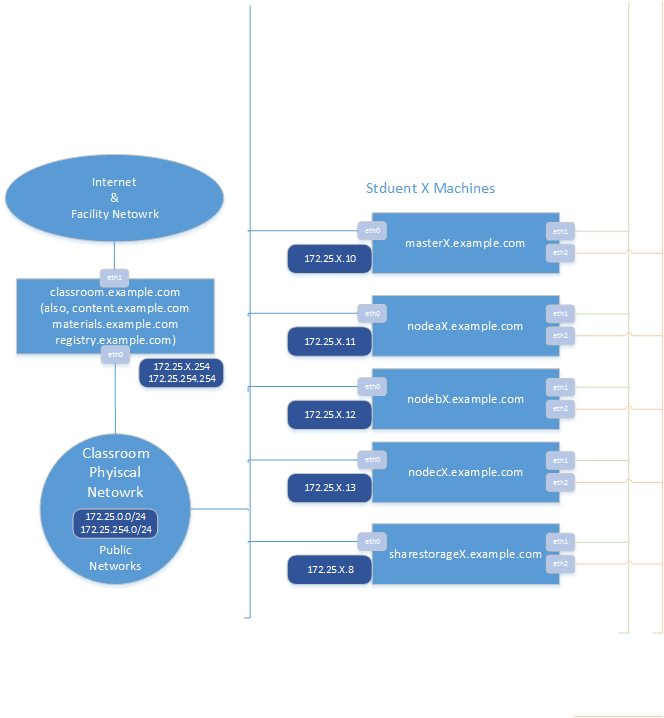

| 设备名          | 主机名           | 说明                          |
| :----------- | :------------ | :-------------------------- |
| master       | masterN       | Kubernetes Master Node 虚拟主机 |
| nodea        | nodeaN        | Kubernetes Node 虚拟机         |
| nodeb        | nodebN        | Kubernetes Node 虚拟机         |
| nodec        | nodecN        | Kubernetes Node 虚拟机         |
| sharestorage | sharestorageN | 共享存储虚拟机                     |

### 配置 Kubernetes 运行环境

安装Kubernetes的方法有很多，你可以从源代码编译安装，也可以通过kubernetes.io网站脚本安装，但是我们推荐大家使用包管理工具安装Kubernetes，这样可以更好的做到环境更迭和升级。

在课程环境中，我们已经做好了基于RedHat YUM的网络包管理环境，RHEL 7.2和Kubernetes 1.4的安装包环境都已就位，课程环境下的所有设备都已设置RHEL 7.2的REPO，但Kubernetes 1.4的REPO没有默认放入设备中，接下来我们将使用YUM RPM的方式安装Kubernetes 1.4。

需要注意的是，演示中的环境是在**Foundation 0** 设备上，大家做实验时请替换设备号为你自己所在设备的**Foundation** 号。 

Kubernetes的运行节点中有一个Master 节点的概念，Master节点上运行Kubernetes的管理服务和etcd数据中心服务。我们将使用master虚拟机安装配置Kubernetes的管理、etcd数据中心、proxy代理等服务。同时选择nodea和nodeb两个虚拟机运行Kubernetes上的资源容器服务。后面将使用nodec来添加和剔除节点。

首先我们先初始化虚拟机设备：

```shell
[kiosk@foundation0 Desktop]$ rht-vmctl reset master
Are you sure you want to reset master? (y/n) y
Powering off master.
Resetting master.
Creating virtual machine disk overlay for up500-master-vda.qcow2
Starting master.
[kiosk@foundation0 Desktop]$ rht-vmctl reset nodea
Are you sure you want to reset nodea? (y/n) y
Powering off nodea.
Resetting nodea.
Creating virtual machine disk overlay for up500-nodea-vda.qcow2
Starting nodea.
[kiosk@foundation0 Desktop]$ rht-vmctl reset nodeb
Are you sure you want to reset nodeb? (y/n) y
Powering off nodeb.
Resetting nodeb.
Creating virtual m
```

确认所有虚拟机设备正常启动后，通过 ssh 连接 master、nodea和nodeb 设备。你可以通过 **view master** 这样的桌面工具连接。根据你自己的设备号替换0。

```shell
[kiosk@foundation0 Desktop]$ ssh root@master0
Last login: Sat Jun  4 14:39:46 2016 from 172.25.0.250
[root@master0 ~]# 
```

```shell
[kiosk@foundation0 Desktop]$ ssh root@nodea0
Last login: Sat Jun  4 14:39:46 2016 from 172.25.0.250
[root@nodea0 ~]# 
```

```shell
[kiosk@foundation0 Desktop]$ ssh root@nodeb0
Last login: Sat Jun  4 14:39:46 2016 from 172.25.0.250
[root@nodeb0 ~]# 
```

#### 关闭防火墙

由于Kubernetes环境需要配置Iptables来完成端口映射和服务代理，所以我们需要关闭系统中的Firewalld防火墙。根据你自己的设备号替换0。

```shell
[kiosk@foundation0 Desktop]$ for i in master0 nodea0 nodeb0 ; do ssh root@$i "systemctl disable firewalld " ; done
Removed symlink /etc/systemd/system/dbus-org.fedoraproject.FirewallD1.service.
Removed symlink /etc/systemd/system/basic.target.wants/firewalld.service.
Removed symlink /etc/systemd/system/dbus-org.fedoraproject.FirewallD1.service.
Removed symlink /etc/systemd/system/basic.target.wants/firewalld.service.
Removed symlink /etc/systemd/system/dbus-org.fedoraproject.FirewallD1.service.
Removed symlink /etc/systemd/system/basic.target.wants/firewalld.service.
```

因为要操作三台虚拟机，所以预先配置好ssh key是明智的选择。如果你没有配置，后续的操作会频繁的输入虚拟机密码。

上一条命令我们仅仅是关闭了Firewalld防火墙的启动开关，接下来我们需要将它停止运行并清除其配置的规则。根据你自己的设备号替换0。

```shell
[kiosk@foundation0 Desktop]$ for i in master0 nodea0 nodeb0 ; do ssh root@$i "systemctl stop firewalld " ; done
```

注意此处是没有回显的，你可以自行测试。

#### 关闭NetworkManager服务

由于Kubernetes环境中将调用IProute2设置网络，为了不使系统的自适应网络服务影响Kubernetes的网络环境，建议关闭NetowrkManager服务。根据你自己的设备号替换0。

```shell
[kiosk@foundation0 Desktop]$ for i in master0 nodea0 nodeb0 ; do ssh root@$i "systemctl disable  NetworkManager " ; done
Removed symlink /etc/systemd/system/multi-user.target.wants/NetworkManager.service.
Removed symlink /etc/systemd/system/dbus-org.freedesktop.NetworkManager.service.
Removed symlink /etc/systemd/system/dbus-org.freedesktop.nm-dispatcher.service.
Removed symlink /etc/systemd/system/multi-user.target.wants/NetworkManager.service.
Removed symlink /etc/systemd/system/dbus-org.freedesktop.NetworkManager.service.
Removed symlink /etc/systemd/system/dbus-org.freedesktop.nm-dispatcher.service.
Removed symlink /etc/systemd/system/multi-user.target.wants/NetworkManager.service.
Removed symlink /etc/systemd/system/dbus-org.freedesktop.NetworkManager.service.
Removed symlink /etc/systemd/system/dbus-org.freedesktop.nm-dispatcher.service.
```

上一条命令我们仅仅是关闭了NetworkManager的启动开关，接下来我们需要将它停止运行。根据你自己的设备号替换0。

```shell
[kiosk@foundation0 Desktop]$ for i in master0 nodea0 nodeb0 ; do ssh root@$i "systemctl stop  NetworkManager " ; done
```

#### 关闭SELinux系统安全机制

由于Kubernetes 1.4与SELinux在运行环境下有已知的Bug，所以我们要在安装Kubernetes 1.4之前关闭系统的SELinux安全机制。根据你自己的设备号替换0。

```shell
[kiosk@foundation0 Desktop]$ for i in master0 nodea0 nodeb0 ; do ssh root@$i "setenforce 0 " ; done
[kiosk@foundation0 Desktop]$ for i in master0 nodea0 nodeb0 ; do ssh root@$i "sed -i 's/SELINUX=enforcing/SELINUX=permissive/' /etc/selinux/config " ; done
```

#### 安装附加软件包

由于目前我们使用的虚拟化系统是最精简的RHEL7.2环境，所以为了后续操作比较方便，我们需要安装wget、bzip2和net-tools软件包。虚拟化系统的YUM环境默认支持RHEL7.2标准包的安装。根据你自己的设备号替换0。

```shell
[kiosk@foundation0 Desktop]$ for i in master0 nodea0 nodeb0 ; do ssh root@$i "yum install wget bzip2 net-tools -y " ; done
Loaded plugins: product-id, search-disabled-repos, subscription-manager
This system is not registered to Red Hat Subscription Management. You can use subscription-manager to register.
Repodata is over 2 weeks old. Install yum-cron? Or run: yum makecache fast
Resolving Dependencies
--> Running transaction check
---> Package bzip2.x86_64 0:1.0.6-13.el7 will be installed
---> Package net-tools.x86_64 0:2.0-0.17.20131004git.el7 will be installed
---> Package wget.x86_64 0:1.14-10.el7_0.1 will be installed
--> Finished Dependency Resolution

-- 中间显示较多，此处忽略 --

Complete!
```

#### 配置Kubernetes YUM源环境

Kubernetes 是基于容器的应用平台，所以需要首先安装Docker。Kubernetes 1.4 支持Docker 1.12的新特性，所以我们建议安装最新的Docker 1.12以发挥其最大的性能。安装Docker1.12和Kubernetes 1.4在我们的实验环境下非常简单，下载环境中的YUM源配置就可以了：

```shell
[kiosk@foundation0 Desktop]$ for i in master0 nodea0 nodeb0 ; do ssh root@$i "wget http://classroom.example.com/materials/kubernetes-1.4.repo -O /etc/yum.repos.d/k8s.repo " ; done
--2016-10-27 23:33:26--  http://classroom.example.com/materials/kubernetes-1.4.repo
Resolving classroom.example.com (classroom.example.com)... 172.25.254.254
Connecting to classroom.example.com (classroom.example.com)|172.25.254.254|:80... connected.
HTTP request sent, awaiting response... 200 OK
Length: 151 [application/x-troff-man]
Saving to: ‘/etc/yum.repos.d/k8s.repo’

     0K                                                       100% 13.1M=0s

2016-10-27 23:33:26 (13.1 MB/s) - ‘/etc/yum.repos.d/k8s.repo’ saved [151/151]

--2016-10-27 23:33:26--  http://classroom.example.com/materials/kubernetes-1.4.repo
Resolving classroom.example.com (classroom.example.com)... 172.25.254.254
Connecting to classroom.example.com (classroom.example.com)|172.25.254.254|:80... connected.
HTTP request sent, awaiting response... 200 OK
Length: 151 [application/x-troff-man]
Saving to: ‘/etc/yum.repos.d/k8s.repo’

     0K                                                       100% 28.2M=0s

2016-10-27 23:33:26 (28.2 MB/s) - ‘/etc/yum.repos.d/k8s.repo’ saved [151/151]

--2016-10-27 23:33:25--  http://classroom.example.com/materials/kubernetes-1.4.repo
Resolving classroom.example.com (classroom.example.com)... 172.25.254.254
Connecting to classroom.example.com (classroom.example.com)|172.25.254.254|:80... connected.
HTTP request sent, awaiting response... 200 OK
Length: 151 [application/x-troff-man]
Saving to: ‘/etc/yum.repos.d/k8s.repo’

     0K                                                       100% 33.8M=0s

2016-10-27 23:33:25 (33.8 MB/s) - ‘/etc/yum.repos.d/k8s.repo’ saved [151/151]
```

如果是公网线上环境，建议设置如下两个源：

```shell
[kevinzou@hk ~]$ cat /etc/yum.repos.d/docker.repo 
[dockerrepo]
name=Docker Repository
baseurl=https://yum.dockerproject.org/repo/main/centos/7/
enabled=1
gpgcheck=1
gpgkey=https://yum.dockerproject.org/gpg

[kevinzou@hk ~]$ cat /etc/yum.repos.d/kubernetes.repo 
[kubernetes]
name=Kubernetes
baseurl=http://yum.kubernetes.io/repos/kubernetes-el7-x86_64
enabled=1
gpgcheck=1
repo_gpgcheck=1
gpgkey=https://packages.cloud.google.com/yum/doc/yum-key.gpg
       https://packages.cloud.google.com/yum/doc/rpm-package-key.gpg
```

### 安装 Kubernetes 1.4

#### 安装软件包

我们需要安装如下软件包：

| 软件包名           | 软件包说明                          |
| -------------- | ------------------------------ |
| docker-engine  | Docker Engine 软件包，提供底层容器支持     |
| kubeadm        | Kubernetes 1.4 新增 配置Cluster工具包 |
| kubectl        | Kubernetes Master环境配置管理工具包     |
| kubelet        | Kubernetes 主程序包                |
| kubernetes-cni | Kubernetes 容器网络配置工具包           |

我们需要在所有节点上安装这些软件包，无论是Manager还是Node。

```shell
[kiosk@foundation0 Desktop]$ for i in master0 nodea0 nodeb0 ; do ssh root@$i "yum install docker-engine kubeadm kubectl kubelet kubernetes-cni -y " ; done
Loaded plugins: product-id, search-disabled-repos, subscription-manager
This system is not registered to Red Hat Subscription Management. You can use subscription-manager to register.
Resolving Dependencies
--> Running transaction check
---> Package docker-engine.x86_64 0:1.12.2-1.el7.centos will be installed
--> Processing Dependency: docker-engine-selinux >= 1.12.2-1.el7.centos for package: docker-engine-1.12.2-1.el7.centos.x86_64
--> Processing Dependency: libcgroup for package: docker-engine-1.12.2-1.el7.centos.x86_64
--> Processing Dependency: libseccomp.so.2()(64bit) for package: docker-engine-1.12.2-1.el7.centos.x86_64
--> Processing Dependency: libltdl.so.7()(64bit) for package: docker-engine-1.12.2-1.el7.centos.x86_64
---> Package kubeadm.x86_64 0:1.5.0-0.alpha.0.1534.gcf7301f will be installed
---> Package kubectl.x86_64 0:1.4.0-0 will be installed
---> Package kubelet.x86_64 0:1.4.0-0 will be installed
--> Processing Dependency: socat for package: kubelet-1.4.0-0.x86_64
---> Package kubernetes-cni.x86_64 0:0.3.0.1-0.07a8a2 will be installed
--> Running transaction check
---> Package docker-engine-selinux.noarch 0:1.12.2-1.el7.centos will be installed
-- 中间显示较多，此处忽略 --
  libseccomp.x86_64 0:2.2.1-1.el7                                               
  libsemanage-python.x86_64 0:2.1.10-18.el7                                     
  libtool-ltdl.x86_64 0:2.4.2-20.el7                                            
  policycoreutils-python.x86_64 0:2.2.5-20.el7                                  
  python-IPy.noarch 0:0.75-6.el7                                                
  setools-libs.x86_64 0:3.3.7-46.el7                                            
  socat.x86_64 0:1.7.2.2-5.el7                                                  

Complete!

```

由于总所周知却不可描述的原因，你可能无法在大陆网络环境下安装这些软件包，请自备梯子。

#### 启动Docker服务

设置docker随系统启动

```shell
[kiosk@foundation0 Desktop]$ for i in master0 nodea0 nodeb0 ; do ssh root@$i "systemctl enable docker kubelet " ; done
Created symlink from /etc/systemd/system/multi-user.target.wants/docker.service to /usr/lib/systemd/system/docker.service.
Created symlink from /etc/systemd/system/multi-user.target.wants/kubelet.service to /etc/systemd/system/kubelet.service.
Created symlink from /etc/systemd/system/multi-user.target.wants/docker.service to /usr/lib/systemd/system/docker.service.
Created symlink from /etc/systemd/system/multi-user.target.wants/kubelet.service to /etc/systemd/system/kubelet.service.
Created symlink from /etc/systemd/system/multi-user.target.wants/docker.service to /usr/lib/systemd/system/docker.service.
Created symlink from /etc/systemd/system/multi-user.target.wants/kubelet.service to /etc/systemd/system/kubelet.service.

```

启动docker 服务

```shell
[kiosk@foundation0 Desktop]$ for i in master0 nodea0 nodeb0 ; do ssh root@$i "systemctl start docker " ; done

```

#### 预导入容器镜像

从Kubernetes 1.4开始，Kubenetes实现了容器化运行其依赖服务，比如etcd、kube-proxy、kube-controller-manager等。因此，在Kubernetes应用启动的时候首先会通过网络下载所需要的容器镜像，由于众所周知且不可描述的原因，Kubernetes所需的Google容器镜像文件大陆地区无法下载，我们访问不到gcr.io网站。

我们通过其他技术手段可以访问gcr.io网站，并下载了这些容器镜像。如果你需要独立下载安装Kubernetes 1.4，请自备梯子。

Master节点需要如下容器镜像：

gcr.io/google_containers/etcd-amd64:2.2.5
gcr.io/google_containers/exechealthz-amd64:1.1
gcr.io/google_containers/kube-apiserver-amd64:v1.4.0
gcr.io/google_containers/kube-controller-manager-amd64:v1.4.0
gcr.io/google_containers/kube-discovery-amd64:1.0
gcr.io/google_containers/kubedns-amd64:1.7
gcr.io/google_containers/kube-dnsmasq-amd64:1.3
gcr.io/google_containers/kube-proxy-amd64:v1.4.0
gcr.io/google_containers/kube-scheduler-amd64:v1.4.0
gcr.io/google_containers/pause-amd64:3.0
weaveworks/weave-kube:1.7.2
weaveworks/weave-npc:1.7.2

Node节点需要如下容器镜像：

gcr.io/google_containers/kube-proxy-amd64:v1.4.0
gcr.io/google_containers/kubernetes-dashboard-amd64:v1.4.0
gcr.io/google_containers/pause-amd64:3.0
weaveworks/weave-kube:1.7.2
weaveworks/weave-npc:1.7.2

在后面的章节中会具体介绍这些容器镜像的具体作用。

接下来在实验环境中下载并导入容器镜像：

1. 下载k8s-1.4-master-img.tbz到Master节点

```shell
[kiosk@foundation0 Desktop]$ ssh root@master0 "wget http://classroom.example.com/materials/k8s-imgs/k8s-1.4-master-img.tbz "
```

2. 下载k8s-1.4-node-img.tbz 到Node节点

```shell
[kiosk@foundation0 Desktop]$ for i in nodea0 nodeb0 ; do ssh root@$i "wget http://classroom.example.com/materials/k8s-imgs/k8s-1.4-node-img.tbz " ; done
```

3. 在Master节点上将k8s-1.4-master-img.tbz文件解包

```shell
[kiosk@foundation0 Desktop]$ ssh root@master0 "tar -jxf k8s-1.4-master-img.tbz" 
```

4. 在Master节点上导入容器镜像

```shell
[kiosk@foundation0 Desktop]$  ssh root@master0 'for i in ./k8s-1.4-master-img/*.img ; do docker load -i  $i ; done'
```

5. 在Node节点上将k8s-1.4-node-img.tbz文件解包

```shell
[kiosk@foundation0 Desktop]$ for i in nodea0 nodeb0 ; do ssh root@$i "tar -jxf k8s-1.4-node-img.tbz " ; done
```

6. 在Node节点上导入容器镜像

```shell
[kiosk@foundation0 Desktop]$ for i in nodea0 nodeb0 ; do ssh root@$i 'for i in ./k8s-1.4-node-img/*.img ; do docker load -i $i  ; done' ; done
```

### 启动 Kubernetes集群

#### 确认kubelet服务启动

保证SELinux关闭的前提下在所有节点上启动kubelet服务

```shell
[kiosk@foundation0 Desktop]$ for i in master0 nodea0 nodeb0 ; do ssh root@$i "hostname ; getenforce " ; done
master0.example.com
Permissive
nodea0.example.com
Permissive
nodeb0.example.com
Permissive

[kiosk@foundation0 Desktop]$ for i in master0 nodea0 nodeb0 ; do ssh root@$i "systemctl start kubelet " ; done

```

此时如果查看节点上的日志文件/var/log/messages，此时会报错出来，原因是没有修改配置文件。

```shell
Oct 28 01:03:50 localhost systemd: Unit kubelet.service entered failed state.
Oct 28 01:03:50 localhost systemd: kubelet.service failed.
Oct 28 01:04:01 localhost systemd: kubelet.service holdoff time over, scheduling restart.
Oct 28 01:04:01 localhost systemd: Started Kubernetes Kubelet Server.
Oct 28 01:04:01 localhost systemd: Starting Kubernetes Kubelet Server...
Oct 28 01:04:01 localhost kubelet: error: failed to run Kubelet: invalid kubeconfig: stat /etc/kubernetes/kubelet.conf: no such file or directory
Oct 28 01:04:01 localhost systemd: kubelet.service: main process exited, code=exited, status=1/FAILURE
```

#### 初始化Kubernetes 1.4 集群

Kubernetes 1.4 受Docker 1.12的影响提供了kubeadm工具，使Kubernetes 1.4的集群搭建非常简单，仅仅两个命令就可以完成集群的初始化和节点的加入。

* 初始化集群环境

```shell
[kiosk@foundation0 Desktop]$ ssh root@master0 "kubeadm init"
<master/tokens> generated token: "279c9d.eb291600fc5d4f6f"
<master/pki> created keys and certificates in "/etc/kubernetes/pki"
<util/kubeconfig> created "/etc/kubernetes/kubelet.conf"
<util/kubeconfig> created "/etc/kubernetes/admin.conf"
<master/apiclient> created API client configuration
<master/apiclient> created API client, waiting for the control plane to become ready
<master/apiclient> all control plane components are healthy after 15.801121 seconds
<master/apiclient> waiting for at least one node to register and become ready
<master/apiclient> first node is ready after 3.007568 seconds
<master/discovery> created essential addon: kube-discovery, waiting for it to become ready
<master/discovery> kube-discovery is ready after 2.504817 seconds
<master/addons> created essential addon: kube-proxy
<master/addons> created essential addon: kube-dns

Kubernetes master initialised successfully!

You can now join any number of machines by running the following on each node:

kubeadm join --token 279c9d.eb291600fc5d4f6f 172.25.0.10

```

请记下最后一行“kubeadm join --token 279c9d.eb291600fc5d4f6f 172.25.0.10”，后面我们节点加入时会用到。

* 查看初始化状态

```shell
[kiosk@foundation0 Desktop]$ ssh root@master0 "kubectl get pod --all-namespaces"
NAMESPACE     NAME                                          READY     STATUS              RESTARTS   AGE
kube-system   etcd-master0.example.com                      1/1       Running             0          6m
kube-system   kube-apiserver-master0.example.com            1/1       Running             1          6m
kube-system   kube-controller-manager-master0.example.com   1/1       Running             0          6m
kube-system   kube-discovery-982812725-l5uow                1/1       Running             0          6m
kube-system   kube-dns-2247936740-uxzfc                     0/3       ContainerCreating   0          6m
kube-system   kube-proxy-amd64-joq3k                        1/1       Running             0          6m
kube-system   kube-scheduler-master0.example.com            1/1       Running             0          6m
```

* 加入新节点

```shell
[kiosk@foundation0 Desktop]$ for i in nodea0 nodeb0 ; do ssh root@$i " kubeadm join --token 279c9d.eb291600fc5d4f6f 172.25.0.10 "  ; done
<util/tokens> validating provided token
<node/discovery> created cluster info discovery client, requesting info from "http://172.25.0.10:9898/cluster-info/v1/?token-id=279c9d"
<node/discovery> cluster info object received, verifying signature using given token
<node/discovery> cluster info signature and contents are valid, will use API endpoints [https://172.25.0.10:443]
<node/csr> created API client to obtain unique certificate for this node, generating keys and certificate signing request
<node/csr> received signed certificate from the API server, generating kubelet configuration
<util/kubeconfig> created "/etc/kubernetes/kubelet.conf"

Node join complete:
* Certificate signing request sent to master and response
  received.
* Kubelet informed of new secure connection details.

Run 'kubectl get nodes' on the master to see this machine join.

<util/tokens> validating provided token
<node/discovery> created cluster info discovery client, requesting info from "http://172.25.0.10:9898/cluster-info/v1/?token-id=279c9d"
<node/discovery> cluster info object received, verifying signature using given token
<node/discovery> cluster info signature and contents are valid, will use API endpoints [https://172.25.0.10:443]
<node/csr> created API client to obtain unique certificate for this node, generating keys and certificate signing request
<node/csr> received signed certificate from the API server, generating kubelet configuration
<util/kubeconfig> created "/etc/kubernetes/kubelet.conf"

Node join complete:
* Certificate signing request sent to master and response
  received.
* Kubelet informed of new secure connection details.

Run 'kubectl get nodes' on the master to see this machine join.

```

* 测试节点状态

```shell
[kiosk@foundation0 Desktop]$  ssh root@master0 "kubectl get nodes"
NAME                  STATUS    AGE
master0.example.com   Ready     10m
nodea0.example.com    Ready     1m
nodeb0.example.com    Ready     1m

[kiosk@foundation0 Desktop]$ ssh root@master0 "kubectl get pod --all-namespaces"
NAMESPACE     NAME                                          READY     STATUS              RESTARTS   AGE
kube-system   etcd-master0.example.com                      1/1       Running             0          13m
kube-system   kube-apiserver-master0.example.com            1/1       Running             1          13m
kube-system   kube-controller-manager-master0.example.com   1/1       Running             0          13m
kube-system   kube-discovery-982812725-l5uow                1/1       Running             0          13m
kube-system   kube-dns-2247936740-uxzfc                     0/3       ContainerCreating   0          13m
kube-system   kube-proxy-amd64-7oy3h                        1/1       Running             0          3m
kube-system   kube-proxy-amd64-joq3k                        1/1       Running             0          13m
kube-system   kube-proxy-amd64-wbyyx                        1/1       Running             0          3m
kube-system   kube-scheduler-master0.example.com            1/1       Running             0          13m

```

  大家会发现kube-dns一直处在ContainerCreating状态，这是因为我们还未配置Kubernetes网络。

* 配置kubernetes网络

  我们使用weave-kube配置Kubernetes网络，公网地址为 https://git.io/weave-kube

```shell
[kiosk@foundation0 Desktop]$ ssh root@master0 "kubectl apply -f http://classroom.example.com/materials/k8s-conf/weave-kube"
daemonset "weave-net" created
```

* 测试节点状态

```shell
[kiosk@foundation0 Desktop]$ ssh root@master0 "kubectl get pod --all-namespaces"
NAMESPACE     NAME                                          READY     STATUS    RESTARTS   AGE
kube-system   etcd-master0.example.com                      1/1       Running   0          22m
kube-system   kube-apiserver-master0.example.com            1/1       Running   1          22m
kube-system   kube-controller-manager-master0.example.com   1/1       Running   0          22m
kube-system   kube-discovery-982812725-l5uow                1/1       Running   0          22m
kube-system   kube-dns-2247936740-uxzfc                     3/3       Running   0          22m
kube-system   kube-proxy-amd64-7oy3h                        1/1       Running   0          12m
kube-system   kube-proxy-amd64-joq3k                        1/1       Running   0          22m
kube-system   kube-proxy-amd64-wbyyx                        1/1       Running   0          12m
kube-system   kube-scheduler-master0.example.com            1/1       Running   0          22m
kube-system   weave-net-15j6s                               2/2       Running   0          3m
kube-system   weave-net-3ybbh                               2/2       Running   0          3m
kube-system   weave-net-8ilap                               2/2       Running   0          3m
```

* 安装kubectl扩展工具

默认情况下我们使用kubernetes控制工具kubectl时是没有自动补全功能的，这样在日常工作中要记忆大量繁琐的命令参数和当前状态值。我们需要生成系统支持的补全（completion）文件，并放置到系统相关目录中。

```shell
[root@master0 ~]# kubectl completion bash >kubectl
[root@master0 ~]# cp kubectl /etc/bash_completion.d/
```

需要重新登录系统此配置才能生效。重新登录master0系统后使用kubectl工具就可以使用TAB键来补全命令了。

### 安装kubernetes-dashboard

Kubernetes 1.2中引入了一个Web UI以方便用户配置管理Kubernetes 集群，这个Web UI就是kubernetes-dashboard。它是Kubernetes官方提供的可视化工具，在Kubernetes 1.4系统中可以完成大多数的管理操作。

在Kubernetes 1.4中安装kubernetes-dashboard是非常简单的，直接使用Kubernetes提供的yaml文件就可以安装，公网yaml文件位置在https://rawgit.com/kubernetes/dashboard/master/src/deploy/kubernetes-dashboard.yaml。我们在实验环境下为大家提供了本地文件。

```shell
[kiosk@foundation0 Desktop]$ ssh root@master0 "kubectl apply -f http://classroom.example.com/materials/k8s-conf/kubernetes-dashboard.yaml "
deployment "kubernetes-dashboard" created
service "kubernetes-dashboard" created
```

kubernetes-dashboard.yaml文件的内容如下，具体的关键字说明会在后面的课程中具体描述：

```yaml
# Copyright 2015 Google Inc. All Rights Reserved.
#
# Licensed under the Apache License, Version 2.0 (the "License");
# you may not use this file except in compliance with the License.
# You may obtain a copy of the License at
#
#     http://www.apache.org/licenses/LICENSE-2.0
#
# Unless required by applicable law or agreed to in writing, software
# distributed under the License is distributed on an "AS IS" BASIS,
# WITHOUT WARRANTIES OR CONDITIONS OF ANY KIND, either express or implied.
# See the License for the specific language governing permissions and
# limitations under the License.

# Configuration to deploy release version of the Dashboard UI.
#
# Example usage: kubectl create -f <this_file>

kind: Deployment
apiVersion: extensions/v1beta1
metadata:
  labels:
    app: kubernetes-dashboard
  name: kubernetes-dashboard
  namespace: kube-system
spec:
  replicas: 1
  selector:
    matchLabels:
      app: kubernetes-dashboard
  template:
    metadata:
      labels:
        app: kubernetes-dashboard
    spec:
      containers:
      - name: kubernetes-dashboard
        image: gcr.io/google_containers/kubernetes-dashboard-amd64:v1.4.0
        imagePullPolicy: IfNotPresent
        # 请注意这里，imagePullPolicy关键字设置了获取容器镜像的策略，网络文件中默认设置为
        # Always 表示每次都下载镜像，我将这里设置为IfNotPresent，这样我们就可以使用之前预
        # 导入的镜像
        ports:
        - containerPort: 9090
          protocol: TCP
        args:
          # Uncomment the following line to manually specify Kubernetes API server Host
          # If not specified, Dashboard will attempt to auto discover the API server and connect
          # to it. Uncomment only if the default does not work.
          # - --apiserver-host=http://my-address:port
        livenessProbe:
          httpGet:
            path: /
            port: 9090
          initialDelaySeconds: 30
          timeoutSeconds: 30
---
kind: Service
apiVersion: v1
metadata:
  labels:
    app: kubernetes-dashboard
  name: kubernetes-dashboard
  namespace: kube-system
spec:
  type: NodePort
  ports:
  - port: 80
    targetPort: 9090
  selector:
    app: kubernetes-dashboard
```

正常创建kubernetes-dashboard服务后，我们需要查看其抛出的随机端口，这个端口号30000~32767之间，Kubernetes 通过kube-proxy服务代理用户请求，具体链接过程我们后面的课程具体介绍。

```shell
[root@master0 ~]# kubectl describe  service --namespace=kube-system
Name:			kube-dns
Namespace:		kube-system
Labels:			component=kube-dns
			k8s-app=kube-dns
			kubernetes.io/cluster-service=true
			name=kube-dns
			tier=node
Selector:		name=kube-dns
Type:			ClusterIP
IP:			100.64.0.10
Port:			dns	53/UDP
Endpoints:		10.46.0.1:53
Port:			dns-tcp	53/TCP
Endpoints:		10.46.0.1:53
Session Affinity:	None
No events.

Name:			kubernetes-dashboard
Namespace:		kube-system
Labels:			app=kubernetes-dashboard
Selector:		app=kubernetes-dashboard
Type:			NodePort
IP:			100.70.61.228
Port:			<unset>	80/TCP
NodePort:		<unset>	30054/TCP
Endpoints:		10.40.0.1:9090
Session Affinity:	None
```

我做实验的时候kubernetes-dashboard的NodePort是30054/TCP，你看到的NodePort应该和我这里不同。通过浏览器firefox访问http://master0.example.com:30054就可以看到Kubernetes UI的界面了。生产环境下需要考虑安全性，应该在前端加认证代理。

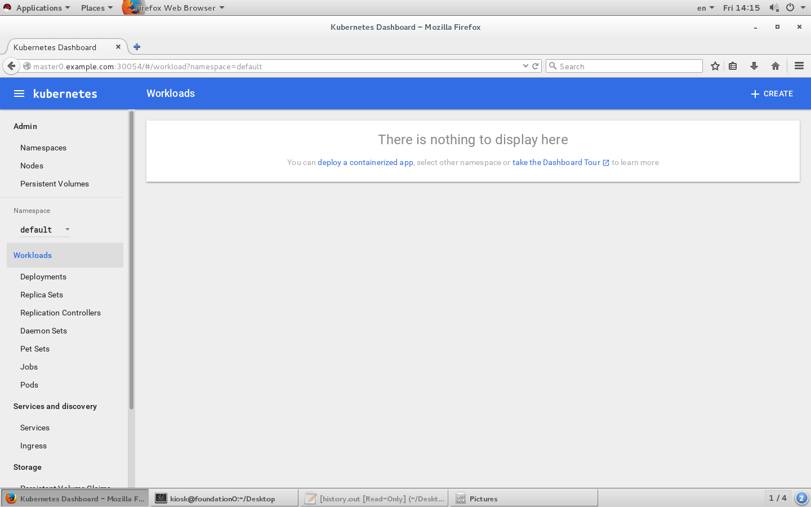

在这里Kubernetes 1.4中有个Bug，本来我们是可以通过https://master0.example.com/ui访问Kubernetes UI的，但是由于代码的兼容问题，导致访问的时候会回显”Unauthorized“信息。

## 管理 Kubernetes 集群服务

### 从简单的WEB服务入手学习

#### kubectl命令介绍

我们后续的操作都是使用kubectl命令来完成的，并使用kubernetes-dashboard WEB UI验证。我们看看如何使用kubectl命令。

首先kubectl命令默认只能在Master节点上运行

```shell
[root@master0 ~]# kubectl cluster-info
Kubernetes master is running at http://localhost:8080
kube-dns is running at http://localhost:8080/api/v1/proxy/namespaces/kube-system/services/kube-dns

To further debug and diagnose cluster problems, use 'kubectl cluster-info dump'.
```

如果要在Node节点上运行，默认会由于无法连接Kubernetes管理服务而报错

```shell
[root@nodea0 ~]# kubectl cluster-info
The connection to the server localhost:8080 was refused - did you specify the right host or port?
```

如果你希望在Node节点上正确的执行kubectl，需要将Master节点上的admin.conf文件拷贝到Node节点上，并明确指定admin.conf的路径。这种操作由于安全性问题不推荐。

```shell
[root@master0 ~]# scp /etc/kubernetes/admin.conf root@nodea0:~/
root@nodea0's password:
admin.conf                                    100% 9190     9.0KB/s   00:00

[root@nodea0 ~]# kubectl --kubeconfig=./admin.conf cluster-info
Kubernetes master is running at https://172.25.0.10:443
kube-dns is running at https://172.25.0.10:443/api/v1/proxy/namespaces/kube-system/services/kube-dns

To further debug and diagnose cluster problems, use 'kubectl cluster-info dump'.
```

请注意上例中的主机名，请替换为你自己的设备号。

kubectl命令的子命令和操作参数比较多，在使用kubectl操作Kubernetes环境之前，我们先罗列出其常用的子命令和操作参数。

kubectl 常用子命令列表：

| 命令             | 说明                                     |
| -------------- | -------------------------------------- |
| get            | 显示资源信息                                 |
| describe       | 详细的描述资源信息                              |
| create         | 通过指定的文件或URL创建资源                        |
| update         | 通过指定的文件或URL修改更新资源                      |
| delete         | 通过指定的文件、URL、资源ID或标签删除资源                |
| namespace      | 设置或显示指定的命名空间（已经弃用）                     |
| logs           | 打印在某Pod中的容器日志信息                        |
| rolling-update | 对给定的副本控制器(ReplicationController)执行滚动更新 |
| scale          | 调整副本管理器(ReplicationController)副本数      |
| exec           | 在某容器中执行命令,类似Docker的exec命令              |
| port-forward   | 为某Pod设置一个或多个端口转发                       |
| proxy          | 运行Kubernetes API Server代理              |
| run            | 在机器中运行一个独立的镜像                          |
| stop           | 通过ID或资源名删除一个资源（已经弃用）                   |
| expose         | 将资源对象暴露为Kubernetes Server              |
| label          | 修改某个资源上的标签                             |
| config         | 修改集群的配置信息                              |
| cluster-info   | 显示集群信息                                 |
| api-versions   | 显示API版本信息                              |
| version        | 打印kubectl和API Server版本信息               |
| help           | 帮助命令                                   |

kubectl 常用可操作资源对象列表：

| 资源对象名称                   | 缩写     |
| :----------------------- | :----- |
| deployments              | de     |
| endpoints                | ep     |
| horizontalpodautoscalers | hpa    |
| ingresses                | ing    |
| limitranges              | limits |
| nodes                    | no     |
| namespaces               | ns     |
| pods                     | po     |
| persistentvolumes        | pv     |
| persistentvolumecails    | pvc    |
| resourcequotas           | quota  |
| replicationcontrollers   | rc     |
| services                 | svc    |
| deployments              | null   |
| jobs                     | null   |
| secrets                  | null   |
| serviceaccounts          | null   |

kubectl 常用命令行公共参数：

| 参数                                  | 说明                                       |
| ----------------------------------- | ---------------------------------------- |
| --alsologtostderr[=false]           | 同时输出日志到标准错误控制台和文件                        |
| --certificate-authority=""          | 用以进行认证授权的.cert文件路径                       |
| --client-certificate=""             | TLS使用的客户端证书路径                            |
| --client-key=""                     | TLS使用的客户端密钥路径                            |
| --cluster=""                        | 指定使用的kubeconfig配置文件中的集群名                 |
| --context=""                        | 指定使用的kubeconfig配置文件中的环境名                 |
| --insecure-skip-tls-verify[=false]: | 如果为true，将不会检查服务器凭证的有效性，这会导致你的HTTPS链接变得不安全 |
| --kubeconfig=""                     | 命令行请求使用的配置文件路径                           |
| --log-backtrace-at=:0               | 当日志长度超过定义的行数时，忽略堆栈信息                     |
| --log-dir=""                        | 如果不为空，将日志文件写入此目录                         |
| --log-flush-frequency=5s            | 刷新日志的最大时间间隔                              |
| --logtostderr[=true]                | 输出日志到标准错误控制台，不输出到文件                      |
| --match-server-version[=false]      | 要求服务端和客户端版本匹配                            |
| --namespace=""                      | 如果不为空，命令将使用指定namespace                   |
| --password=""                       | API Server进行简单认证使用的密码                    |
| -s, --server=""                     | Kubernetes API Server的地址和端口号             |
| --stderrthreshold=2                 | 高于此级别的日志将被输出到错误控制台                       |
| --token=""                          | 认证到API Server使用的令牌                       |
| --user=""                           | 指定使用的kubeconfig配置文件中的用户名                 |
| --username=""                       | API Server进行简单认证使用的用户名                   |
| --v=0                               | 指定输出日志的级别                                |
| --vmodule=                          | 指定输出日志的模块，格式如下：pattern=N，使用逗号分隔          |

#### 创建简单Pod

Kubernetes创建对象的时候一般是使用预定义文件编写对象信息说明，然后使用kubectl工具或kubernetes-dashboard UI来创建。由于我们在内网完成此操作，所以需要预先将镜像导入所有node节点，如果你是在公网环境下，则不需要预先导入镜像。

1. 下载镜像文件压缩包

```shell
[kiosk@foundation0 Desktop]$ for i in nodea0 nodeb0 ; do ssh root@$i "wget http://classroom.example.com/materials/k8s-imgs/nginx-img.tbz " ; done
```

2. 在节点上解开压缩包

```shell
[kiosk@foundation0 Desktop]$ for i in nodea0 nodeb0 ; do ssh root@$i "tar -jxf nginx-img.tbz " ; done
```

3. 将镜像导入节点系统


```shell
[kiosk@foundation0 Desktop]$ for i in nodea0 nodeb0 ; do ssh root@$i 'for i in ./nginx/*.img ; do docker load -i $i  ; done' ; done
```

我们以nginx web应用为例创建我们第一个Pod。以下是创建Pod的yaml文件内容：

```yaml
apiVersion: v1
kind: Pod
metadata:
  name: nginx
spec:
  containers:
  - name: nginx
    image: nginx:latest
    imagePullPolicy: IfNotPresent
    ports:
    - containerPort: 80
```

将文件保存为nginx-pod.yaml，后面我们将使用”kubectl create“命令来创建nginx Pod。文件中的标签我们后面具体介绍。

```shell
# 查看配置文件内容
[root@master0 ~]# cat nginx-pod.yaml
apiVersion: v1
kind: Pod
metadata:
  name: nginx
spec:
  containers:
  - name: nginx
    image: nginx:latest
    imagePullPolicy: IfNotPresent
    ports:
    - containerPort: 80
    
# 创建Pod nginx
[root@master0 ~]# kubectl create -f nginx-pod.yaml
pod "nginx" created

# 查看Pod 状态和信息
[root@master0 ~]# kubectl get pod
NAME      READY     STATUS    RESTARTS   AGE
nginx     1/1       Running   0          31s

# 查看Pod nginx的详细信息
[root@master0 ~]# kubectl describe pod nginx
Name:		nginx
Namespace:	default
Node:		nodea0.example.com/172.25.0.11
Start Time:	Fri, 28 Oct 2016 08:39:58 +0800
Labels:		<none>
Status:		Running
IP:		10.32.0.2
Controllers:	<none>
Containers:
  nginx:
    Container ID:	docker://76ff103f17a4024c94e3d28d2a98814bc943be8626216965e9be43726179d37c
    Image:		nginx:latest
    Image ID:		docker://sha256:e43d811ce2f4986aa69bc8ba6c92f0789537f604d1601e0b6ec024e1c38062b4
    Port:		80/TCP
    State:		Running
      Started:		Fri, 28 Oct 2016 08:40:28 +0800
    Ready:		True
    Restart Count:	0
    Volume Mounts:
      /var/run/secrets/kubernetes.io/serviceaccount from default-token-d6l71 (ro)
    Environment Variables:	<none>
Conditions:
  Type		Status
  Initialized 	True
  Ready 	True
  PodScheduled 	True
Volumes:
  default-token-d6l71:
    Type:	Secret (a volume populated by a Secret)
    SecretName:	default-token-d6l71
QoS Class:	BestEffort
Tolerations:	<none>
Events:
  FirstSeen	LastSeen	Count	From				SubobjectPath		Type		Reason		Message
  ---------	--------	-----	----				-------------		--------	------		-------
  1m		1m		1	{default-scheduler }			Normal		Scheduled	Successfully assigned nginx to nodea0.example.com
  55s		55s		1	{kubelet nodea0.example.com}	spec.containers{nginx}	Normal		Pulling		pulling image "nginx:latest"
  35s		35s		1	{kubelet nodea0.example.com}	spec.containers{nginx}	Normal		Pulled		Successfully pulled image "nginx:latest"
  32s		32s		1	{kubelet nodea0.example.com}	spec.containers{nginx}	Normal		Created		Created container with docker id 76ff103f17a4; Security:[seccomp=unconfined]
  31s		31s		1	{kubelet nodea0.example.com}	spec.containers{nginx}	Normal		Started		Started container with docker id 76ff103f17a4
```

目前创建的Pod是无法在外部访问的，在配置文件中我们指定的80/tcp端口只能Kubernetes内指定运行的其他Pod访问。为能够访问这个nginx，我们还要创建一个基本容器（busybox），使用这个基本容器来测试Pod的访问状态。

```shell
[root@master0 ~]# kubectl run busybox --image=busybox:latest --restart=Never --tty -i --generator=run-pod/v1 --env="POD_IP=$(kubectl get pod nginx -o go-template='{{.status.podIP}}')"
Waiting for pod default/busybox to be running, status is Pending, pod ready: false
Waiting for pod default/busybox to be running, status is Pending, pod ready: false
Waiting for pod default/busybox to be running, status is Pending, pod ready: false
Waiting for pod default/busybox to be running, status is Pending, pod ready: false
Waiting for pod default/busybox to be running, status is Pending, pod ready: false
Waiting for pod default/busybox to be running, status is Pending, pod ready: false
Waiting for pod default/busybox to be running, status is Pending, pod ready: false
If you don't see a command prompt, try pressing enter.
/ # ifconfig
eth0      Link encap:Ethernet  HWaddr 9E:D6:D2:44:B5:9A
          inet addr:10.40.0.3  Bcast:0.0.0.0  Mask:255.240.0.0
          inet6 addr: fe80::9cd6:d2ff:fe44:b59a/64 Scope:Link
          UP BROADCAST RUNNING MULTICAST  MTU:1410  Metric:1
          RX packets:10 errors:0 dropped:0 overruns:0 frame:0
          TX packets:4 errors:0 dropped:0 overruns:0 carrier:0
          collisions:0 txqueuelen:0
          RX bytes:816 (816.0 B)  TX bytes:300 (300.0 B)

lo        Link encap:Local Loopback
          inet addr:127.0.0.1  Mask:255.0.0.0
          inet6 addr: ::1/128 Scope:Host
          UP LOOPBACK RUNNING  MTU:65536  Metric:1
          RX packets:0 errors:0 dropped:0 overruns:0 frame:0
          TX packets:0 errors:0 dropped:0 overruns:0 carrier:0
          collisions:0 txqueuelen:0
          RX bytes:0 (0.0 B)  TX bytes:0 (0.0 B)

/ # echo $POD_IP
10.32.0.3
/ # wget -qO- http://$POD_IP
<!DOCTYPE html>
<html>
<head>
<title>Welcome to nginx!</title>
<style>
    body {
        width: 35em;
        margin: 0 auto;
        font-family: Tahoma, Verdana, Arial, sans-serif;
    }
</style>
</head>
<body>
<h1>Welcome to nginx!</h1>
<p>If you see this page, the nginx web server is successfully installed and
working. Further configuration is required.</p>

<p>For online documentation and support please refer to
<a href="http://nginx.org/">nginx.org</a>.<br/>
Commercial support is available at
<a href="http://nginx.com/">nginx.com</a>.</p>

<p><em>Thank you for using nginx.</em></p>
</body>
</html>
/ # exit
Waiting for pod default/busybox to terminate, status is Running
```

以上操作中，我们通过kubectl的run命令创建了一个Pod busybox，并创建busybox容器的虚拟控制台，通过虚拟控制台查看busybox容器的IP，并连接nginx容器查看其状态。具体的参数我们后面会逐一介绍。

操作完毕后删除临时创建的Pod busybox。

```shell
[root@master0 ~]# kubectl delete pod busybox
pod "busybox" deleted
```

Pod的状态包括以下几种：

| 状态        | 说明                                    |
| --------- | ------------------------------------- |
| Pending   | 已经创建该Pod，但Pod中还有若干容器没有完成运行，可能正在下载容器镜像 |
| Running   | Pod中所有容器已经运行，包括容器启动状态或重启状态            |
| Succeeded | Pod中所有容器成功退出，且不会继续重启                  |
| Failed    | Pod中所有容器已经退出，但容器为失败状态，可能由于无法下载容器镜像    |
| Unknown   | 由于某种原因无法获取Pod状态，可能由于Master和Node网络通信不畅 |

#### 设置Pod Label

同样的步骤我们可以创建更多的Pod，但如何去区分Pod呢？ 我们使用之前的讲过的概念—Label。

将原有的nginx-pod.yaml文件在本地拷贝为web-pod.yaml，并添加label标签项目。

```yaml
apiVersion: v1
kind: Pod
metadata:
  name: web
  labels:
     app: nginx-web
spec:
  containers:
  - name: nginx
    image: nginx:latest
    imagePullPolicy: IfNotPresent
    ports:
    - containerPort: 80
```

接下来和前面创建Pod nginx一样，我们可以创建Pod  web ，和Pod nginx不同，初始化创建的时候，我们就设置了其Label，为“app：nginx-web”。

```shell
创建Pod web
[root@master0 ~]# kubectl create -f web-pod.yaml
pod "web" created

查看Pod 的状态和信息
[root@master0 ~]# kubectl get pod
NAME      READY     STATUS    RESTARTS   AGE
nginx     1/1       Running   1          7d
web       1/1       Running   0          13s

查看Pod web 的详细信息
[root@master0 ~]# kubectl describe pod web
Name:		web
Namespace:	default
Node:		nodea0.example.com/172.25.0.11
Start Time:	Fri, 04 Nov 2016 14:03:12 +0800
Labels:		app=nginx-web
Status:		Running
IP:		10.32.0.4
Controllers:	<none>
Containers:
  nginx:
    Container ID:	docker://06c006624e46532ae8daee0683b533225a4c69f26302a7387d062b0d3627522e
    Image:		nginx:latest
    Image ID:		docker://sha256:e43d811ce2f4986aa69bc8ba6c92f0789537f604d1601e0b6ec024e1c38062b4
    Port:		80/TCP
    State:		Running
      Started:		Fri, 04 Nov 2016 14:03:23 +0800
    Ready:		True
    Restart Count:	0
    Volume Mounts:
      /var/run/secrets/kubernetes.io/serviceaccount from default-token-d6l71 (ro)
    Environment Variables:	<none>
Conditions:
  Type		Status
  Initialized 	True
  Ready 	True
  PodScheduled 	True
Volumes:
  default-token-d6l71:
    Type:	Secret (a volume populated by a Secret)
    SecretName:	default-token-d6l71
QoS Class:	BestEffort
Tolerations:	<none>
Events:
  FirstSeen	LastSeen	Count	From				SubobjectPath		Type		Reason		Message
  ---------	--------	-----	----				-------------		--------	------		-------
  7m		7m		1	{default-scheduler }					Normal		Scheduled	Successfully assigned web to nodea0.example.com
  7m		7m		1	{kubelet nodea0.example.com}	spec.containers{nginx}	Normal		Pulling		pulling image "nginx:latest"
  7m		7m		1	{kubelet nodea0.example.com}	spec.containers{nginx}	Normal		Pulled		Successfully pulled image "nginx:latest"
  7m		7m		1	{kubelet nodea0.example.com}	spec.containers{nginx}	Normal		Created		Created container with docker id 06c006624e46; Security:[seccomp=unconfined]
  7m		7m		1	{kubelet nodea0.example.com}	spec.containers{nginx}	Normal		Started		Started container with docker id 06c006624e46

```

可以发现，相对Pod nginx，在Pod web详细信息中Lables栏目中有“app=nginx-web”，而Pod nginx详细信息中Lables栏目为"<none>"。

我们可以通过kubectl -l 参数通过指定Label 信息指定Pod。

```shell
[root@master0 ~]# kubectl get pod
NAME      READY     STATUS    RESTARTS   AGE
nginx     1/1       Running   1          7d
web       1/1       Running   0          15m

[root@master0 ~]# kubectl get pod  -l app=nginx-web
NAME      READY     STATUS    RESTARTS   AGE
web       1/1       Running   0          15m
```

我们要给已经创建的Pod nginx设置Label也很容易，使用kubectl lable 命令就可以了。

```shell
[root@master0 ~]# kubectl label pod nginx app=nginx-test
pod "nginx" labeled
```

如果要覆盖一个已经设置的Label 需要在kubectl label 命令后加上—overwrite参数。

```shell
[root@master0 ~]# kubectl label --overwrite pod nginx app=nginx-foo
pod "nginx" labeled
```

如果要删除一个Pod 的Label，需要的仅仅是在label的名字后加上”-“号。

```shell
[root@master0 ~]# kubectl label  pod nginx app-
pod "nginx" labeled
```

#### 创建多容器Pod

在同一个Pod中，我们可以创建多个相互关联的容器，在容器之间可以通过Volume共享数据。

接下来的例子中，我们将使用到nginx:latest和busybox:latest两个镜像，并建立一个emptyDir类型的Volume，用以共享存储。

首先我们要创建一个多容器Pod配置文件：

```yaml
apiVersion: v1
kind: Pod
metadata:
  name: multicontainer-pod
spec:
  containers:
  - name: nginx
    image: nginx:latest
    imagePullPolicy: IfNotPresent
    ports:
    - containerPort: 80
    volumeMounts: # spec.volumeMounts[] 设置挂接卷
    - name: htmlroot # spec.volumeMounts[].name 挂接卷名称，由spec.volumes[].name定义
      mountPath: /usr/share/nginx/html # 挂接到容器路径
  - name: busybox
    image: busybox:latest
    imagePullPolicy: IfNotPresent
    command: ["sh","-c","while : ; do sleep 10 ; done"] # 容器执行命令
    volumeMounts:
    - name: htmlroot
      mountPath: /mnt
  volumes: # spec.volumes[] 定义卷类型
  - name: htmlroot # spec.volumes[].name 定义卷名称，容器挂接卷时引用
    emptyDir: {} # 卷类型
```

将多容器Pod配置文件保存为multicontainer_pod.yaml ，在Master上使用kubectl创建：

```shell
[root@master0 ~]# kubectl create -f multicontainer_pod.yaml
pod "multicontainer-pod" created
```

等待pod被创建成功后，我们可以查看当前多容器Pod的状态：

```shell
[root@master0 ~]# kubectl get pod multicontainer-pod
NAME                 READY     STATUS    RESTARTS   AGE
multicontainer-pod   2/2       Running   0          1m
[root@master0 ~]# kubectl describe pod multicontainer-pod
Name:		multicontainer-pod
Namespace:	default
Node:		nodea0.example.com/172.25.0.11
Start Time:	Tue, 22 Nov 2016 16:26:16 +0800
Labels:		<none>
Status:		Running
IP:		10.40.0.1
Controllers:	<none>
Containers:
  nginx:
    Container ID:	docker://4ee4004da7e92b15da43af86947a6a4d649207c5e9d95f0a1ffe88e9a0655306
    Image:		nginx:latest
    Image ID:		docker://sha256:05a60462f8bafb215ddc5c20a364b5fb637670200a74a5bb13a1b23f64515561
    Port:		80/TCP
    State:		Running
      Started:		Tue, 22 Nov 2016 16:26:27 +0800
    Ready:		True
    Restart Count:	0
    Volume Mounts:
      /usr/share/nginx/html from htmlroot (rw)
      /var/run/secrets/kubernetes.io/serviceaccount from default-token-k5azo (ro)
    Environment Variables:	<none>
  busybox:
    Container ID:	docker://a3831df2aa83f55b90f0e54dbc75026d2d28721803e3e754f3c6f6076db53645
    Image:		busybox:latest
    Image ID:		docker://sha256:e02e811dd08fd49e7f6032625495118e63f597eb150403d02e3238af1df240ba
    Port:
    Command:
      sh
      -c
      while : ; do sleep 10 ; done
    State:		Running
      Started:		Tue, 22 Nov 2016 16:26:33 +0800
    Ready:		True
    Restart Count:	0
    Volume Mounts:
      /mnt from htmlroot (rw)
      /var/run/secrets/kubernetes.io/serviceaccount from default-token-k5azo (ro)
    Environment Variables:	<none>
Conditions:
  Type		Status
  Initialized 	True
  Ready 	True
  PodScheduled 	True
Volumes:
  htmlroot:
    Type:	EmptyDir (a temporary directory that shares a pod's lifetime)
    Medium:
  default-token-k5azo:
    Type:	Secret (a volume populated by a Secret)
    SecretName:	default-token-k5azo
QoS Class:	BestEffort
Tolerations:	<none>
Events:
  FirstSeen	LastSeen	Count	From				SubobjectPath			Type		Reason		Message
  ---------	--------	-----	----				-------------			--------	------		-------
  1m		1m		1	{default-scheduler }						Normal		Scheduled	Successfully assigned multicontainer-pod to nodea0.example.com
  1m		1m		1	{kubelet nodea0.example.com}	spec.containers{nginx}		Normal		Pulled		Container image "nginx:latest" already present on machine
  1m		1m		1	{kubelet nodea0.example.com}	spec.containers{nginx}		Normal		Created		Created container with docker id 4ee4004da7e9; Security:[seccomp=unconfined]
  1m		1m		1	{kubelet nodea0.example.com}	spec.containers{nginx}		Normal		Started		Started container with docker id 4ee4004da7e9
  1m		1m		1	{kubelet nodea0.example.com}	spec.containers{busybox}	Normal		Pulled		Container image "busybox:latest" already present on machine
  1m		1m		1	{kubelet nodea0.example.com}	spec.containers{busybox}	Normal		Created		Created container with docker id a3831df2aa83; Security:[seccomp=unconfined]
  1m		1m		1	{kubelet nodea0.example.com}	spec.containers{busybox}	Normal		Started		Started container with docker id a3831df2aa83
```

我们可以通过kubectl exec 命令连接Pod中的容器，查看并测试共享卷。

```shell
# 连接multicontainer-pod中的busybox容器
[root@master0 ~]# kubectl exec multicontainer-pod -c busybox -it /bin/sh

# 使用df 查看磁盘挂接情况，请注意/mnt目录挂接情况
/ # df
Filesystem           1K-blocks      Used Available Use% Mounted on
/dev/mapper/docker-253:0-669894-c8bc33b61e5399bfb777d2d306ce707322234fa8217c188bacc3389b0cc3dbef
                      10474496     34672  10439824   0% /
tmpfs                   508396         0    508396   0% /dev
tmpfs                   508396         0    508396   0% /sys/fs/cgroup
/dev/mapper/rhel-root
                       9226240   4034764   5191476  44% /mnt
/dev/mapper/rhel-root
                       9226240   4034764   5191476  44% /dev/termination-log
/dev/mapper/rhel-root
                       9226240   4034764   5191476  44% /etc/resolv.conf
/dev/mapper/rhel-root
                       9226240   4034764   5191476  44% /etc/hostname
/dev/mapper/rhel-root
                       9226240   4034764   5191476  44% /etc/hosts
shm                      65536         0     65536   0% /dev/shm
tmpfs                   508396        12    508384   0% /var/run/secrets/kubernetes.io/serviceaccount
tmpfs                   508396         0    508396   0% /proc/kcore
tmpfs                   508396         0    508396   0% /proc/timer_list
tmpfs                   508396         0    508396   0% /proc/timer_stats
tmpfs                   508396         0    508396   0% /proc/sched_debug

# 我们进入 /mnt 目录后创建 index.html文件，并写入测试字符串
/ # cd /mnt
/mnt # ls
/mnt # echo "<h1>busybox</hi>" > index.html
/mnt # exit
```

退出busybox容器，再连接nginx容器：

```shell
[root@master0 ~]# kubectl exec multicontainer-pod -c nginx -it /bin/sh
# df
Filesystem                                                                                       1K-blocks    Used Available Use% Mounted on
/dev/mapper/docker-253:0-669894-985f5295e7838bcf7b60c163493cd010b1a5665a9ab46955ffdc6f7cadbf8f66  10474496  232540  10241956   3% /
tmpfs                                                                                               508396       0    508396   0% /dev
tmpfs                                                                                               508396       0    508396   0% /sys/fs/cgroup
/dev/mapper/rhel-root                                                                              9226240 4035728   5190512  44% /etc/hosts
shm                                                                                                  65536       0     65536   0% /dev/shm
tmpfs                                                                                               508396      12    508384   1% /run/secrets/kubernetes.io/serviceaccount
# cd /usr/share/nginx/html
# ls
index.html
# cat index.html
<h1>busybox</hi>
# exit
```

可以看出多容器Pod中的nginx和busybox容器共享了一个存储卷。

测试成功后，不要忘记做清除操作：

```shell
[root@master0 ~]# kubectl delete  -f multicontainer_pod.yaml
pod "multicontainer-pod" deleted
```

#### 创建简单Deployment

我们可以通过一次配置启动多个Pod ，并且保证当Pod损坏或销毁时可以自动重建。这就需要Depolyment来完成。

首先创建nginx-deployment.yaml 文件，文件内容如下：

```yaml
apiVersion: extensions/v1beta1
kind: Deployment
metadata:
  name: nginx-deployment
spec:
  replicas: 2 
  template: 
    metadata:
      labels:
        app: nginx
    spec:
      containers:
      - name: nginx
        image: nginx:latest
        imagePullPolicy: IfNotPresent
        ports:
        - containerPort: 80
```

此文件指定了Deployment 的名字为nginx-deployment，将创建两个replicas，也就是将有两个新的Pod。

运行kubectl create命令，创建Deloyment 。

```shell
[root@master0 ~]# kubectl create -f nginx-deployment.yaml
deployment "nginx-deployment" created
```

创建成功后可以看到：

```shell
[root@master0 ~]# kubectl get deployment
NAME               DESIRED   CURRENT   UP-TO-DATE   AVAILABLE   AGE
nginx-deployment   2         2         2            0           13s
```

同时有两个新的Pod被创建出来：

```shell
root@master0 ~]# kubectl get pod
NAME                                READY     STATUS    RESTARTS   AGE
nginx-deployment-2947857529-3dpz6   1/1       Running   0          25s
nginx-deployment-2947857529-xt8gd   1/1       Running   0          25s
```

如果你没有清除之前创建的Pod ，可以通过Label来分拣这两个新的Pod：

```shell
[root@master0 ~]# kubectl get pod -l app=nginx
NAME                                READY     STATUS    RESTARTS   AGE
nginx-deployment-2947857529-3dpz6   1/1       Running   0          55s
nginx-deployment-2947857529-xt8gd   1/1       Running   0          55s
```

当然，我们可以是直接使用kubectl run 命令来创建Deployment。

```shell
[root@master0 ~]# kubectl run run-nginx --image=nginx:latest --replicas=2 --labels=app=nginx-run --port=80
deployment "run-nginx" created
```

查看Deployment信息：

```shell
[root@master0 ~]# kubectl get deployment run-nginx
NAME               DESIRED   CURRENT   UP-TO-DATE   AVAILABLE   AGE
run-nginx          2         2         2            2           55s
```

查看创建的Pod信息：

```shell
[root@master0 ~]# kubectl get pod 
NAME                                READY     STATUS    RESTARTS   AGE
nginx-deployment-2947857529-3dpz6   1/1       Running   0          5m
nginx-deployment-2947857529-xt8gd   1/1       Running   0          5m
run-nginx-1357102973-02c4z          1/1       Running   0          1m
run-nginx-1357102973-c7pkm          1/1       Running   0          1m
```

也可以根据Label分拣Pod：

```shell
[root@master0 ~]# kubectl get pod -l app=nginx-run
NAME                         READY     STATUS    RESTARTS   AGE
run-nginx-1357102973-02c4z   1/1       Running   0          2m
run-nginx-1357102973-c7pkm   1/1       Running   0          2m
```

为了下次创建Deployment更加方便，我们可以将现在运行的Deployment的创建信息导出为yaml格式文件：

```shell
[root@master0 ~]# kubectl --export  -o yaml get deployment run-nginx | tee nginx-run.yaml
apiVersion: extensions/v1beta1
kind: Deployment
metadata:
  annotations:
    deployment.kubernetes.io/revision: "1"
  creationTimestamp: null
  generation: 1
  labels:
    app: nginx-run
  name: run-nginx
  selfLink: /apis/extensions/v1beta1/namespaces//deployments/run-nginx
spec:
  replicas: 2
  selector:
    matchLabels:
      app: nginx-run
  strategy:
    rollingUpdate:
      maxSurge: 1
      maxUnavailable: 1
    type: RollingUpdate
  template:
    metadata:
      creationTimestamp: null
      labels:
        app: nginx-run
    spec:
      containers:
      - image: nginx:latest
        imagePullPolicy: IfNotPresent
        name: run-nginx
        ports:
        - containerPort: 80
          protocol: TCP
        resources: {}
        terminationMessagePath: /dev/termination-log
      dnsPolicy: ClusterFirst
      restartPolicy: Always
      securityContext: {}
      terminationGracePeriodSeconds: 30
status: {}
```

之后我们需要再次创建或在其他的集群环境中创建此Deployment，就可以使用kubectl create命令来完成了。

我们可以完成以下步骤测试删除Deployment run-nginx然后通过导出的yaml文件重新创建run-nginx。

```shell
[root@master0 ~]# kubectl delete deployment run-nginx
deployment "run-nginx" deleted

[root@master0 ~]# kubectl create  -f nginx-run.yaml
deployment "run-nginx" created

[root@master0 ~]# kubectl get deployment run-ngix
NAME               DESIRED   CURRENT   UP-TO-DATE   AVAILABLE   AGE
run-nginx          2         2         2            2           24s
```

#### 创建简单Service

在我们已经创建Pod和Deployment的基础上，我们可以创建Service以使外部用户可以访问到Kubernetes内的应用服务。

首先创建nginx-server.yaml 文件，文件内容如下：

```yaml
apiVersion: v1
kind: Service
metadata:
  name: nginx-service
spec:
  ports:
  - port: 8000
    targetPort: 80
    protocol: TCP
  selector:
    app: nginx
  type: LoadBalancer
```

指定Service名为nginx-service，设置集群内部端口为8000，对应到Pod中的80端口，协议类型为TCP，选择器指定Lable为app=nginx的Deployment，使用负载均衡的方式访问Pod。

运行kubectl create命令，创建Service：

```shell
[root@master0 ~]# kubectl create -f nginx-service.yaml
```

查看当前的Service状态：

```shell
[root@master0 ~]# kubectl get service
NAME            CLUSTER-IP      EXTERNAL-IP   PORT(S)    AGE
kubernetes      100.64.0.1      <none>        443/TCP    12d
nginx-service   100.68.22.181   <pending>     8000/TCP   1m
```

查看nginx-service服务的具体情况：

```shell
[root@master0 ~]# kubectl describe service nginx-service
Name:			nginx-service
Namespace:		default
Labels:			<none>
Selector:		app=nginx
Type:			LoadBalancer
IP:			100.68.22.181
Port:			<unset>	8000/TCP
NodePort:		<unset>	32690/TCP
Endpoints:		10.32.0.13:80,10.40.0.9:80
Session Affinity:	None
```

NodePort就是我们可以通过外部访问到的服务端口，可以通过curl或firefox访问确认。Session Affinity是指定是否保持Session，后面的课程中我们会深入的介绍。

```shell
[root@foundation0 ~]# curl http://master0.example.com:32690
<!DOCTYPE html>
<html>
<head>
<title>Welcome to nginx!</title>
<style>
    body {
        width: 35em;
        margin: 0 auto;
        font-family: Tahoma, Verdana, Arial, sans-serif;
    }
</style>
</head>
<body>
<h1>Welcome to nginx!</h1>
<p>If you see this page, the nginx web server is successfully installed and
working. Further configuration is required.</p>

<p>For online documentation and support please refer to
<a href="http://nginx.org/">nginx.org</a>.<br/>
Commercial support is available at
<a href="http://nginx.com/">nginx.com</a>.</p>

<p><em>Thank you for using nginx.</em></p>
</body>
</html>
```

目前nginx-service是由nginx-deployment提供资源，而nginx-deployment是由两个Pod组成的。

```shell
[root@master0 ~]# kubectl get deployment -l app=nginx
NAME               DESIRED   CURRENT   UP-TO-DATE   AVAILABLE   AGE
nginx-deployment   2         2         2            2           4d
[root@master0 ~]# kubectl get pods -l app=nginx
NAME                                READY     STATUS    RESTARTS   AGE
nginx-deployment-2947857529-3dpz6   1/1       Running   2          4d
nginx-deployment-2947857529-xt8gd   1/1       Running   2          4d
```

我们可以通过修改两个Pod上nginx的主页来查看Service轮训负载均衡的状态：

```shell
[root@master0 ~]# kubectl exec -it nginx-deployment-2947857529-3dpz6 /bin/bash
root@nginx-deployment-2947857529-3dpz6:/# echo "<h1>Pod A</h1>" > /usr/share/nginx/html/index.html
root@nginx-deployment-2947857529-3dpz6:/# exit
exit
[root@master0 ~]# kubectl exec -it nginx-deployment-2947857529-xt8gd /bin/bash
root@nginx-deployment-2947857529-xt8gd:/# echo "<h1>Pod B</h1>" > /usr/share/nginx/html/index.html
root@nginx-deployment-2947857529-xt8gd:/# exit
exit
```

在外部机器上使用curl或firefox你可以查看到访问是轮训的：

```shell
[root@foundation0 ~]# curl http://master0.example.com:32690
<h1>Pod B</h1>
[root@foundation0 ~]# curl http://master0.example.com:32690
<h1>Pod A</h1>
[root@foundation0 ~]# curl http://master0.example.com:32690
<h1>Pod A</h1>
[root@foundation0 ~]# curl http://master0.example.com:32690
<h1>Pod A</h1>
[root@foundation0 ~]# curl http://master0.example.com:32690
<h1>Pod B</h1>
```

为方便后续内容的介绍和实验，我们可以将创建的Service、Deployment和Pod尽数删除。

```shell
[root@master0 ~]# kubectl delete service nginx-service
service "nginx-service" deleted

[root@master0 ~]# kubectl delete deployment nginx-deployment
deployment "nginx-deployment" deleted

[root@master0 ~]# kubectl delete deployment run-nginx
deployment "run-nginx" deleted

[root@master0 ~]# kubectl delete pod nginx
pod "nginx" deleted

[root@master0 ~]# kubectl delete pod web
pod "web" deleted
```

#### 同时创建Deployment和Service

分别创建Pod、Deployment和Service既麻烦又不利于关联性，所以在生产环境中，我们会将所以得对象创建整合在一个配置文件中定义，并通过统一的配置文件来创建Service。

在上一节中，我们按部就班的创建了nginx-service服务，并且在测试成功后删除了所有自定对象。目前kubernetes环境下没有任何自定义对象了：

```shell
[root@master0 ~]# kubectl get pod
[root@master0 ~]# kubectl get deployment
[root@master0 ~]# kubectl get service
NAME         CLUSTER-IP   EXTERNAL-IP   PORT(S)   AGE
kubernetes   100.64.0.1   <none>        443/TCP   12d
```

我们可以将前面创建Deployment和Service的配置文件修改并合并起来成为新的配置文件my-nginx.yaml:

```yaml
apiVersion: extensions/v1beta1
kind: Deployment
metadata:
  name: nginx-deployment
spec:
  replicas: 2
  template:
    metadata:
      labels:
        app: nginx
    spec:
      containers:
      - name: nginx
        image: nginx:latest
        imagePullPolicy: IfNotPresent
        ports:
        - containerPort: 80
---
apiVersion: v1
kind: Service
metadata:
  name: nginx-service
spec:
  ports:
  - port: 8000
    targetPort: 80
    protocol: TCP
  selector:
    app: nginx
  type: LoadBalancer
```

注意：在两个不同部分之间需要使用三个“-”号组成的间隔符号用以区分不同的设置区域。

使用my-nginx.yaml配置文件创建运行环境：

```shell
[root@master0 ~]# kubectl create -f my-nginx.yaml
deployment "nginx-deployment" created
service "nginx-service" created
```

可以看出kubectl还是根据配置文件分别创建Deployment和Service的。

我们仍然可以通过kubectl查看当前的Pod、Deployment和Service状态，并获得访问Service的外部端口。其操作和之前单独建立Service时没有区别。

### 创建复杂的多Service微服务环境

#### 部署镜像

复杂的微服务环境需要多个镜像来完成环境搭建，他们分为前端web应用和后端数据库应用。我们在此例子中我们将完成一个留言板应用微服务，它是由前端php应用和后端redis数据库组成，并且为了保证业务的正常运行，我们可以设置前端和后端运行多副本的方式。

前端服务镜像为kissingwolf/guestbook-frontend，后端服务镜像为kissingwolf/redis-mater和kissingwolf/redis-slave。这个微服务是建立在前端php应用链接redis数据库的基础上的。

1. 下载镜像文件压缩包

```shell
[kiosk@foundation0 Desktop]$ for i in nodea0 nodeb0 ; do ssh root@$i "wget http://classroom.example.com/materials/k8s-imgs/guestbook-img.tbz " ; done
```

2. 在节点上解开压缩包

```shell
[kiosk@foundation0 Desktop]$ for i in nodea0 nodeb0 ; do ssh root@$i "tar -jxf guestbook-img.tbz " ; done
```

3. 将镜像导入节点系统

```shell
[kiosk@foundation0 Desktop]$ for i in nodea0 nodeb0 ; do ssh root@$i 'for i in ./guestbook/*.img ; do docker load -i $i  ; done' ; done
```

如果在公网上实验，可以跳过部署镜像的步骤，所有镜像均可以在hub.docker.com上找到并通过kubernetes自动下载。

#### 编写微服务部署配置文件

我们将要建立的是一个线上留言板微服务，此微服务包括三个kubernetes Service：redis-master、redis-slave和frontend。

```yaml
apiVersion: v1
kind: Service
metadata:
  name: redis-master
  labels:
    app: redis
    tier: backend
    role: master
spec:
  ports:
  - port: 6379
    targetPort: 6379
  selector:
    app: redis
    tier: backend
    role: master
---
apiVersion: extensions/v1beta1
kind: Deployment
metadata:
  name: redis-master
spec:
  template:
    metadata:
      labels:
        app: redis
        role: master
        tier: backend
    spec:
      containers:
      - name: master
        image: kissingwolf/redis-master:latest
        imagePullPolicy: IfNotPresent
        ports:
        - containerPort: 6379
---
apiVersion: v1
kind: Service
metadata:
  name: redis-slave
  labels:
    app: redis
    tier: backend
    role: slave
spec:
  ports:
  - port: 6379
  selector:
    app: redis
    tier: backend
    role: slave
---
apiVersion: extensions/v1beta1
kind: Deployment
metadata:
  name: redis-slave
spec:
  replicas: 2
  template:
    metadata:
      labels:
        app: redis
        role: slave
        tier: backend
    spec:
      containers:
      - name: slave
        image: kissingwolf/redis-slave:latest
        imagePullPolicy: IfNotPresent
        env:
        - name: GET_HOSTS_FROM
          value: dns
        ports:
        - containerPort: 6379
---
apiVersion: v1
kind: Service
metadata:
  name: frontend
  labels:
    app: guestbook
    tier: frontend
spec:
  type: LoadBalancer
  ports:
  - port: 80
  selector:
    app: guestbook
    tier: frontend
---
apiVersion: extensions/v1beta1
kind: Deployment
metadata:
  name: frontend
spec:
  replicas: 3
  template:
    metadata:
      labels:
        app: guestbook
        tier: frontend
    spec:
      containers:
      - name: php-redis
        image: kissingwolf/guestbook-frontend:latest
        imagePullPolicy: IfNotPresent
        env:
        - name: GET_HOSTS_FROM
          value: dns
        ports:
        - containerPort: 80
```

将以上内容保存为guestbook.yaml文件，放置到master0主机上，请使用自己的foundation号替换0。

此文件由三个连续“-”符号分为了六个部分：三个Service块和三个Deployment块，我们分别介绍其作用。

redis-mater Service块：

```yaml
apiVersion: v1 # api版本
kind: Service # 配置类型
metadata: # 元信息配置
  name: redis-master # metadata.name Service名称，需符合命名规范
  labels: # metadata.labels[] 自定义标签属性列表
    app: redis # 自定义标签属性
    tier: backend # 自定义标签属性
    role: master # 自定义标签属性
spec: # 详细描述，用以配置Service
  ports: # spec.ports[] Service 需要暴露的端口号列表
  - port: 6379 # spec.ports[].port Service 监听的端口号，默认为TCP
    targetPort: 6379 # spec.ports[].targetPort 需要转发到后端的端口号，默认为TCP，如果与port一致可以省略不写。
  selector: # spec.selector[] 标签选择器，将符合标签的Deployment关联Service
    app: redis # 查找的目标标签属性
    tier: backend # 查找的目标标签属性
    role: master # 查找的目标标签属性
```

redis-master Deployment块：

```yaml
apiVersion: extensions/v1beta1 # api版本
kind: Deployment # 配置类型
metadata: # 元信息配置
  name: redis-master # metadata.name Deployment名称，需符合命名规范
spec: # 详细描述，用以配置Deployment
  template: # spec.template 容器的定义，此部分和Pod定义的内容基本一致
    metadata: # spec.template.metadata 元数据配置
      labels: # spec.template.metadata.labels[] 自定义标签属性列表
        app: redis # 自定义标签属性
        role: master # 自定义标签属性
        tier: backend # 自定义标签属性
    spec: # spec.template.spce 容器的详细描述
      containers: # spec.template.spce.containers[] Pod中运行容器的详细列表
      - name: master # spec.template.spce.containers[].name 容器名称
        image: kissingwolf/redis-master:latest # .image 容器镜像名称
        imagePullPolicy: IfNotPresent # .imagePullPolicy 获得镜像的策略
        ports: # spec.template.spce.containers[].ports[] 容器需要暴露的端口号列表
        - containerPort: 6379 # .containerPort 容器需要监听的端口号，默认为TCP
```

redis-slave Service块，与redis-master Service基本一致：

```yaml
apiVersion: v1
kind: Service
metadata:
  name: redis-slave
  labels:
    app: redis
    tier: backend
    role: slave
spec:
  ports:
  - port: 6379
  selector:
    app: redis
    tier: backend
    role: slave
```

redis-slave Deployment块，与redis-master Depolyment 定义相仿的地方我们就不再啰嗦了：

```yaml
apiVersion: extensions/v1beta1
kind: Deployment
metadata:
  name: redis-slave
spec:
  replicas: 2 # spec.replicas 设置Pod的副本数，如果设置为0，则不创建Pod
  template:
    metadata:
      labels:
        app: redis
        role: slave
        tier: backend
    spec:
      containers:
      - name: slave
        image: kissingwolf/redis-slave:latest
        imagePullPolicy: IfNotPresent
        env: # spec.template.spec.containers[].env[] 容器运行前需要设置的环境变量列表
        - name: GET_HOSTS_FROM # 容器内环境变量名
          value: dns # 设置变量对应的值
        ports:
        - containerPort: 6379
```

容器化管理的理念是容器内运行的程序和结构与容器环境管理者无关！我们不用在乎容器内的配置和运行程序安装、运行和处理的问题，容器对应容器环境的管理者应该是个黑盒子，容器管理者应该像执行一条命令一样运行一个容器。在这个例子中，我们不用关心redis-master和redis-slave是如何通讯的，就好像我们不需要关心两个程序是如何由管道符号“|”连接起输入输出的。

frontend Service 块：

```yaml
apiVersion: v1
kind: Service
metadata:
  name: frontend
  labels:
    app: guestbook
    tier: frontend
spec:
  type: LoadBalancer # spec.type 指定Service的访问方式，LoadBalancer指定kube-proxy完成负载分发，默认会在每个node上指定一个相同的30000以上端口监听。
  ports:
  - port: 80
  selector:
    app: guestbook
    tier: frontend    
```

frontend Deployment 块：

```yaml
apiVersion: extensions/v1beta1
kind: Deployment
metadata:
  name: frontend
spec:
  replicas: 3
  template:
    metadata:
      labels:
        app: guestbook
        tier: frontend
    spec:
      containers:
      - name: php-redis
        image: kissingwolf/guestbook-frontend:latest
        imagePullPolicy: IfNotPresent
        env:
        - name: GET_HOSTS_FROM
          value: dns
        ports:
        - containerPort: 80
```

综上，我们在配置中指定将创建三个服务，redis-master服务创建1个pod，redis-slave服务创建2个pod，而前端web服务frontend创建3个pod。可以充分做到冗余和负载均衡。

#### 启动微服务

编写好guestbook.yaml配置文件后，可以使用kubectl create命令创建这个由三个自服务组成的微服务。

```shell
[root@master0 ~]# kubectl create -f guestbook.yaml
service "redis-master" created
deployment "redis-master" created
service "redis-slave" created
deployment "redis-slave" created
service "frontend" created
deployment "frontend" created
```

我们可以同过kubectl get 命令查看Pod、Deployment和Service的状态：

```shell
[root@master0 ~]# kubectl get pods
NAME                            READY     STATUS    RESTARTS   AGE
frontend-2027482420-7viu0       1/1       Running   0          2m
frontend-2027482420-ai4zb       1/1       Running   0          2m
frontend-2027482420-g8mfr       1/1       Running   0          2m
redis-master-2712522894-8t10c   1/1       Running   0          2m
redis-slave-2928339718-kkuio    1/1       Running   0          2m
redis-slave-2928339718-ysakf    1/1       Running   0          2m
```

```shell
[root@master0 ~]# kubectl get deployment
NAME           DESIRED   CURRENT   UP-TO-DATE   AVAILABLE   AGE
frontend       3         3         3            3           3m
redis-master   1         1         1            1           3m
redis-slave    2         2         2            2           3m
```

```shell
[root@master0 ~]# kubectl get service
NAME           CLUSTER-IP       EXTERNAL-IP   PORT(S)    AGE
frontend       100.65.209.142   <pending>     80/TCP     4m
kubernetes     100.64.0.1       <none>        443/TCP    13d
redis-master   100.74.117.129   <none>        6379/TCP   4m
redis-slave    100.71.128.170   <none>        6379/TCP   4m
```

#### 访问微服务

当前我们Guestbook微服务中，负责处理用户请求的前端服务frontend注册到kubernetes后，kube-proxy将代理其监听请求，并开启一个30000以上端口的监听。

```shell
[root@master0 ~]# kubectl describe service frontend
Name:			frontend
Namespace:		default
Labels:			app=guestbook
			    tier=frontend
Selector:		app=guestbook,tier=frontend
Type:			LoadBalancer
IP:			100.65.209.142
Port:			<unset>	80/TCP
NodePort:		<unset>	31876/TCP
Endpoints:		10.32.0.18:80,10.32.0.19:80,10.40.0.15:80
Session Affinity:	None
```

NodePort 指定的就是kube-proxy监听的端口，frontend服务目前的端口是31876/TCP，你机器上会有不同。在master和每个node上都有。

```shell
[root@foundation0 ~]# for i in master0 nodea0 nodeb0 ; do ssh root@$i "hostname ; netstat -natp |grep ':31876' " ; done 
master0.example.com
tcp6       0      0 :::31876                :::*                    LISTEN      3679/kube-proxy
nodea0.example.com
tcp6       0      0 :::31876                :::*                    LISTEN      2886/kube-proxy
nodeb0.example.com
tcp6       0      0 :::31876                :::*                    LISTEN      3060/kube-proxy
```

我们可以通过浏览器访问master或任意节点，其访问均通过kube-proxy均衡的分发到各个pod上。并且在Node或Pod损坏的情况下自动迁移和恢复服务。

### 创建带共享存储卷的Service环境

#### 创建NFS共享存储卷

我们可以使用很多种方法和软件导出并共享NFS卷，在我们当前的环境中，比较方便的做法是使用sharestorage虚拟机，利用已经安装好的openfiler系统导出NFS卷。

Openfiler是一种开源的共享存储系统，可以支持NFS、CIFS和iSCSI等共享方式。在我们的现有环境中它充当共享存储设备。

首先我们启动本地的sharestorage虚拟机：

```shell
[kiosk@foundation0 ~]$ rht-vmctl start sharestorage
```

启动正常以后我们就可以访问共享存储设备了，虚拟机为sharestorage，主机名为sharestorageN，域名为sharestorageN.example.com。 N为你的Foundation 号，我演示机的Foundation 号为0。

打开浏览器访问sharestorage的配置界面，登录地址为http://sharestorageN.example.com:446 , 用户名为openfiler，密码为uplooking。

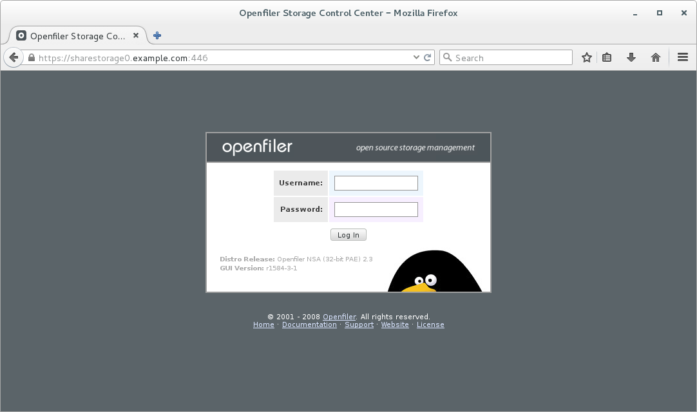

登录后看到如下界面

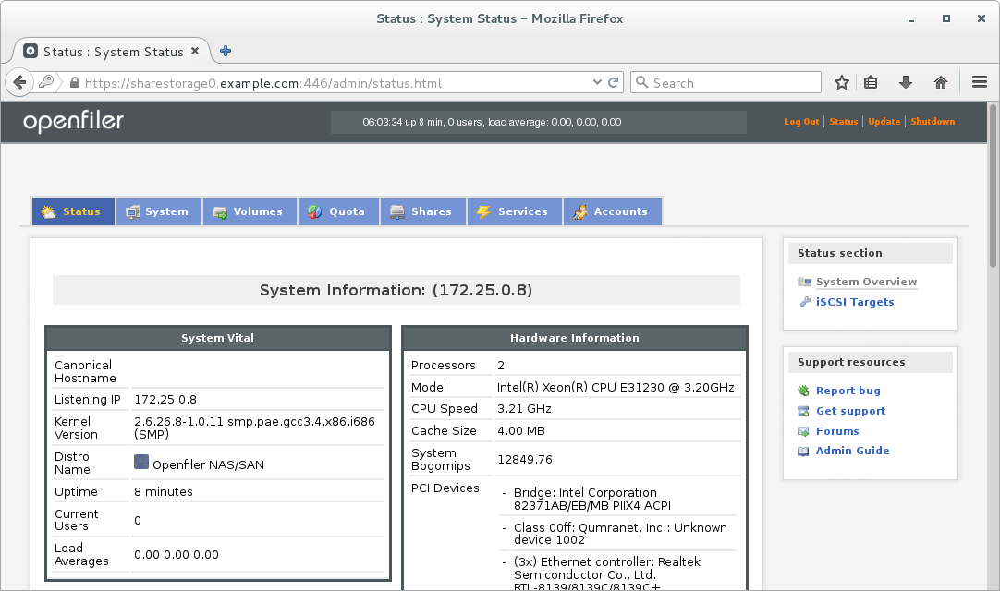

 点击”Services"，然后点击“NFSv3 server"后的”Enable“，打开NFS服务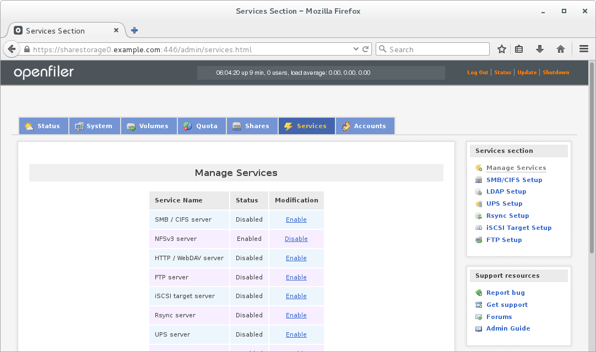

 打开NFS服务后，点击”Volumes“创建一个新的卷组，“create new physical volumes"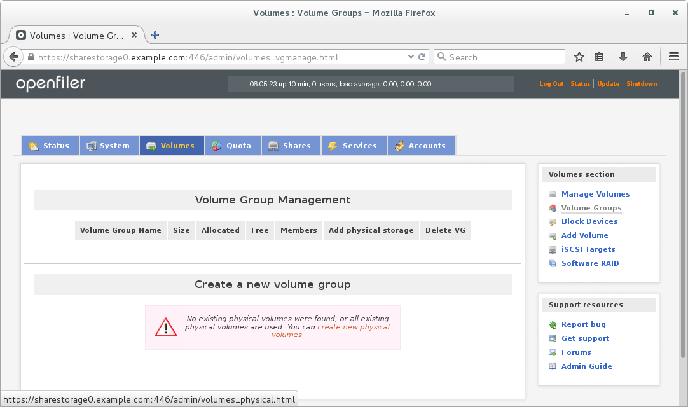

 选择”/dev/hdb"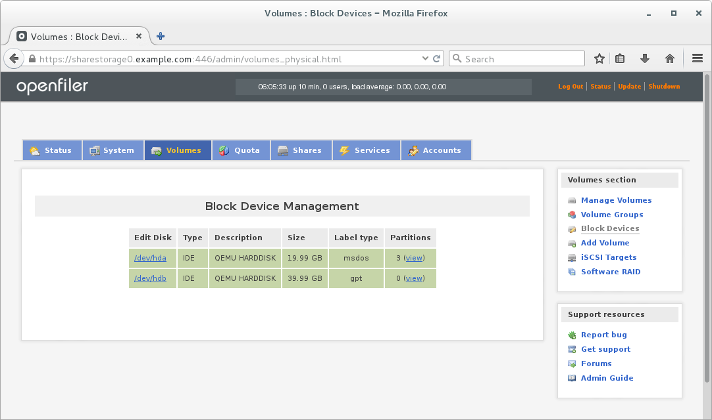

 点击“create”，创建物理卷

 创建好物理卷后，点击“shares”，再点击“create a new filesystem volume"，创建文件系统卷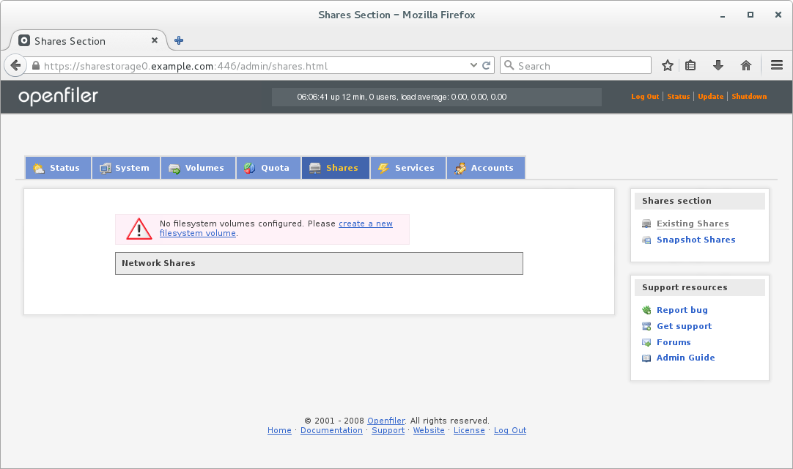

 在”Volume group name“中填入”share“，并且勾选”/dev/hdb1"

 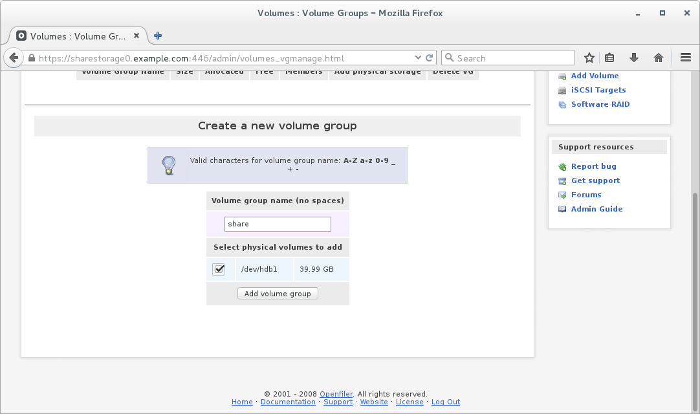

 点击“Add volume group”，后在“Volumes”中可以看到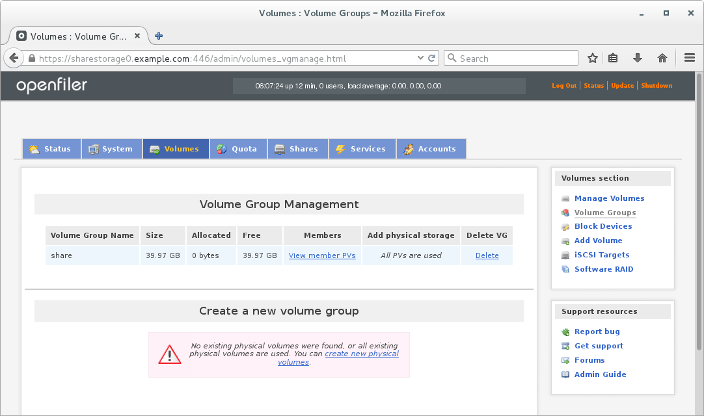

 在“Shares”中可以看到我们建好的“Network Shares”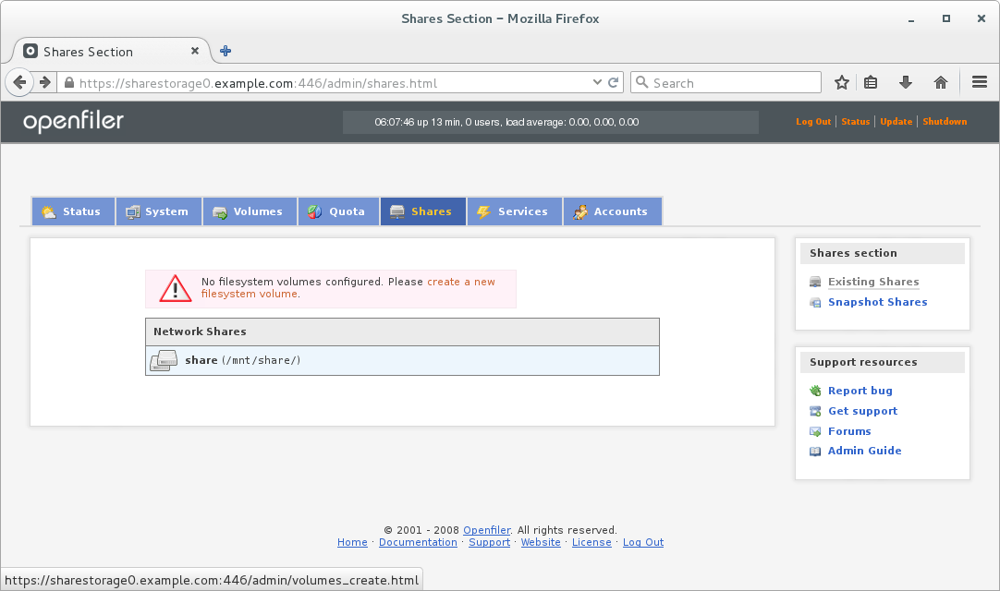

 点击“Volumes”，可以在“Volumes Section”中选择“Add Volume"，创建卷”nfs“，设置”Required Space （MB）“为5000，点击”Create“创建

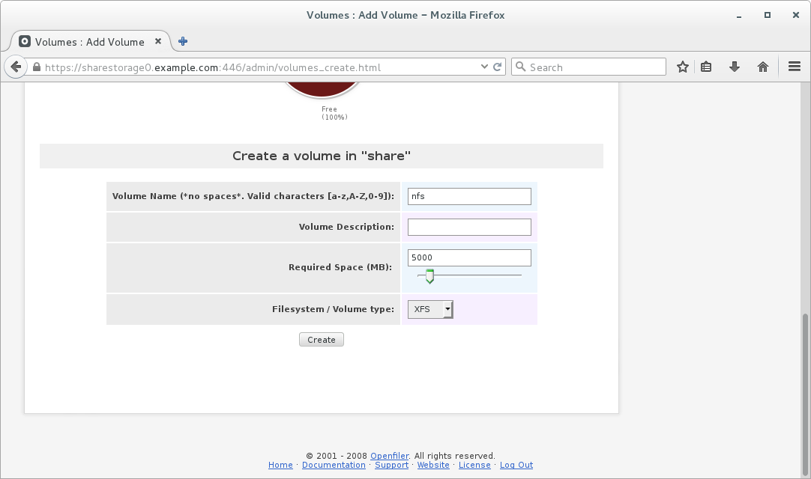

 可以看到，”nfs“卷已经建立好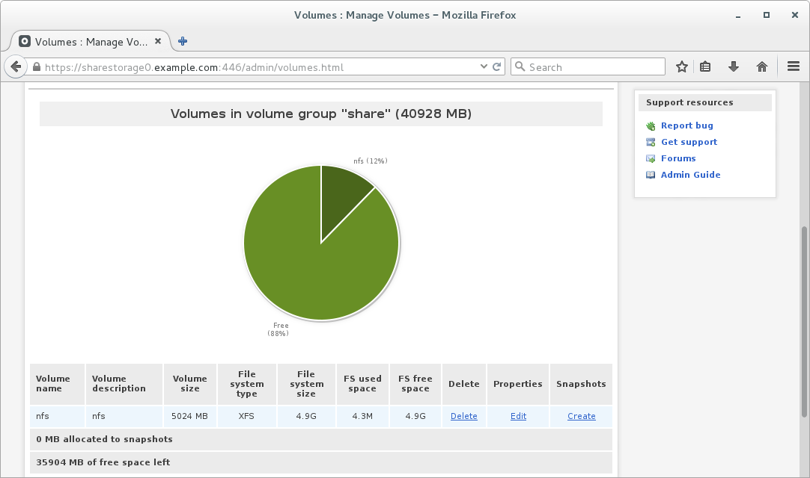

 由于安全方面的考虑，我们需要设置能够访问此共享设备的网络，请点击“System”，拉到页面下方，在“Network Access Configuration”，填入name:"mynet"，Netework:"172.25.0.0"，Netmask:"255.255.0.0"。点击”Update“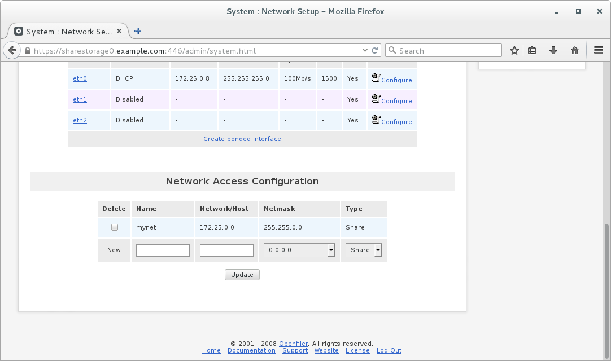

然后点击”Shares“，点选Network Shares 中的”nfs“，创建导出 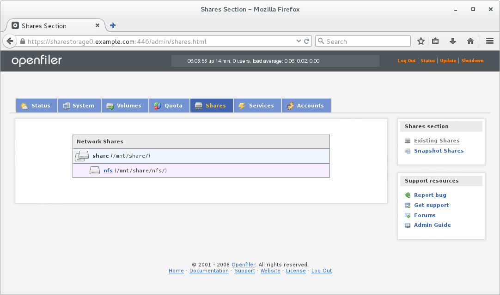

 在”Folder name“中填入”k8s“，点击”Create Sub-folder“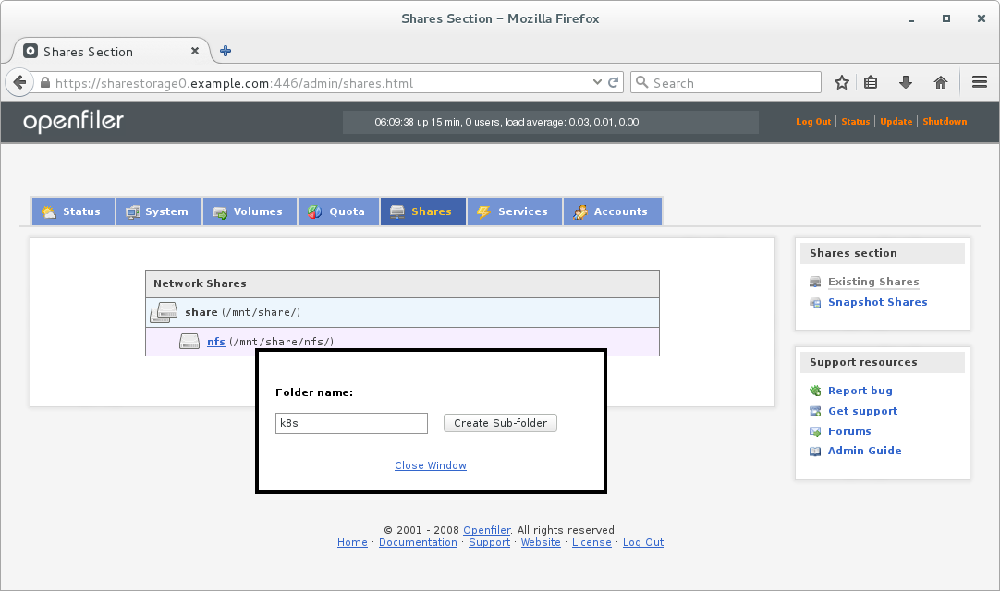

 创建好后，点击”k8s“，点击”Make Share“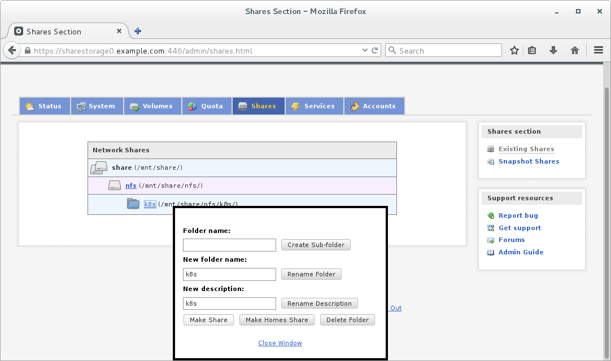

 进入共享设置中，在“Share Access Control Mode”中选“Plublic guest access”，点“Update”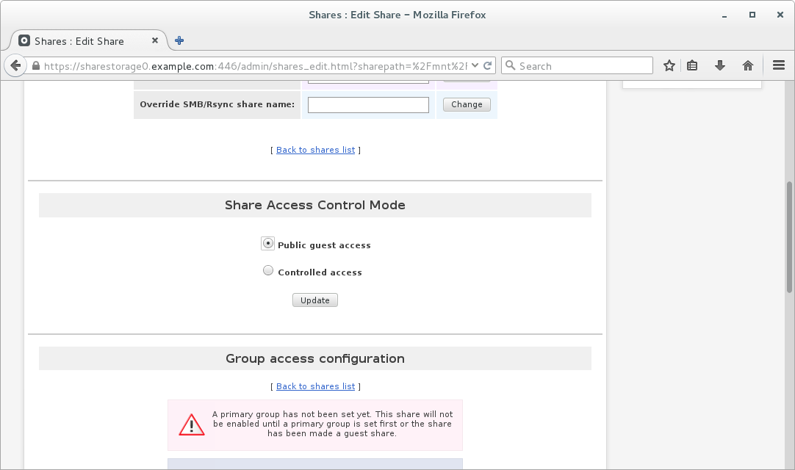

然后下拉页面，看到“Host access configuration"，在NFS项目中选”RW“，然后“Update” 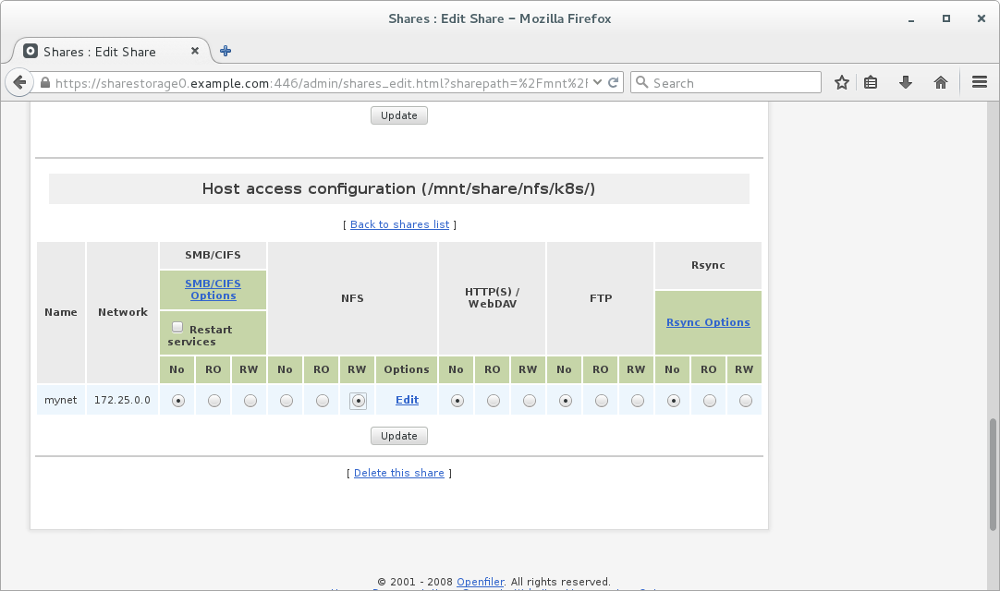

至此，共享存储设备端就配置了NFS导出设备及文件系统。

NFS导出的路径为：sharestorageN.example.com:/mnt/share/nfs/k8s ，你可以在其他系统中测试挂接。N为你的机器号。

Master和Node设备上要挂接此共享设备需要安装nfs客户端相关软件包，并且启动相应服务：

```shell
[root@master0 ~]# yum install nfs-utils -y
[root@master0 ~]# systemctl start rpcbind
[root@nodea0 ~]# yum install nfs-utils -y
[root@nodea0 ~]# systemctl start rpcbind
[root@nodeb0 ~]# yum install nfs-utils -y
[root@nodeb0 ~]# systemctl start rpcbind
```

将sharestorageN.example.com:/mnt/share/nfs/k8s挂接到Master主机的/mnt目录下，方便后期测试使用，其他Node无需挂接

```shell
[root@master0 ~]# mount sharestorage0.example.com:/mnt/share/nfs/k8s /mnt
```

#### 编写挂接共享存储服务配置文件

我们创建一个配置文件nfs-nginx-service-pv.yaml，其中包括创建PV、PVC、Deployment和Service的配置项目

```yaml
apiVersion: v1
kind: PersistentVolume
metadata:
  name: nfspv001
spec:
  capacity:
    storage: 5Gi
  accessModes:
    - ReadWriteMany
  nfs:
    path: /mnt/share/nfs/k8s
    server: 172.25.0.8

---

apiVersion: v1
kind: PersistentVolumeClaim
metadata:
  name: myclaim001
spec:
  accessModes:
    - ReadWriteMany
  resources:
    requests:
      storage: 3Gi

---

apiVersion: extensions/v1beta1
kind: Deployment
metadata:
  name: nginx-deployment-pv
spec:
  replicas: 2
  template:
    metadata:
      labels:
        app: nginx-pv
    spec:
      containers:
      - name: nginx-pv
        image: nginx:latest
        imagePullPolicy: IfNotPresent
        ports:
        - containerPort: 80
        volumeMounts:
        - mountPath: "/usr/share/nginx/html"
          name: mypvc
      volumes:
      - name: mypvc
        persistentVolumeClaim:
          claimName: myclaim001

---

apiVersion: v1
kind: Service
metadata:
  name: nginx-service-pv
spec:
  ports:
  - port: 8000
    targetPort: 80
    protocol: TCP
  selector:
    app: nginx-pv
  type: LoadBalancer
```

此文件由三个连续“-”符号分为了四个部分：Persistent Volume、Persistent Volume Claim、Deployment 和Service。

Persistent Volume 部分用以定义网络存储卷：

```yaml
apiVersion: v1 # Api 版本
kind: PersistentVolume # 配置类型
metadata: # 元数据
  name: nfspv001 # metadata.name 网络存储卷名称，需符合命名规范
spec: # 详细信息
  capacity: # 容量定义
    storage: 5Gi # 存储容量
  accessModes: # 访问方式 
    - ReadWriteMany # ReadWriteMany 可读写，可以被多个Node挂接
  nfs: # 卷类型为nfs
    path: /mnt/share/storage1/k8s # 挂接目录
    server: 172.25.0.8 # nfs 服务器IP
```

Persistent Volume Claim 部分用以定义网络存储卷区域，分配给Pod Volume的对象

```yaml
apiVersion: v1 # Api 版本
kind: PersistentVolumeClaim # 配置类型
metadata: # 元数据 
  name: myclaim001 # metadata.name 网络存储卷对象名称，需符合命名规范
spec: # 详细信息
  accessModes: # 访问模式
    - ReadWriteMany # ReadWriteMany 可读写，可以被多个Node挂接
  resources: # 资源定义
    requests: # 具体配置
      storage: 3Gi # 存储容量
```

Deployment 部分用以定义Pod副本具体对象信息，包括挂接Volume对象信息

```yaml
apiVersion: extensions/v1beta1 # Api 版本
kind: Deployment # 配置类型
metadata: # 元数据
  name: nginx-deployment-pv # metadata.name Deployment 对象名称，需符合命名规范
spec: # 详细信息
  replicas: 2 # 副本数
  template: # Pod 对象模板信息
    metadata: # 元数据
      labels: # 标签
        app: nginx-pv # 自定义标签信息
    spec: # spec.template.spce 容器的详细描述
      containers: # 容器对象信息
      - name: nginx # 容器名
        image: nginx:latest # 镜像信息
        imagePullPolicy: IfNotPresent # 镜像下载方式
        ports: # 端口信息
        - containerPort: 80 # 容器暴露端口
        volumeMounts: # 容器挂接卷信息
        - mountPath: "/usr/share/nginx/html" # 容器挂接卷到本地路径
          name: mypvc # 卷名称
      volumes: # 卷定义
      - name: mypvc # 卷名定义
        persistentVolumeClaim: # 定义使用PVC设置卷
          claimName: myclaim001 # PVC卷名

```

Service 部分用以定义服务具体对象信息

```yaml
apiVersion: v1
kind: Service
metadata:
  name: nginx-service
spec:
  ports:
  - port: 8000
    targetPort: 80
    protocol: TCP
  selector:
    app: nginx-pv
  type: LoadBalancer
```

#### 启动带共享存储卷的Service环境

编写好nfs-nginx-service-pv.yaml配置文件后，可以通过kubectl create 命令创建Service及其相关对象。

```shell
[root@master0 ~]# kubectl create -f nfs-nginx-service-pv.yaml
persistentvolume "nfspv001" created
persistentvolumeclaim "myclaim001" created
deployment "nginx-deployment" created
service "nginx-service-pv" created
```

我们可以通过kubectl相关命令查看创建好的对象：

```shell
# 查看PV 对象
[root@master0 ~]# kubectl get pv
NAME       CAPACITY   ACCESSMODES   RECLAIMPOLICY   STATUS    CLAIM                REASON    AGE
nfspv001   5Gi        RWX           Retain          Bound     default/myclaim001             1m
[root@master0 ~]# kubectl describe pv
Name:		nfspv001
Labels:		<none>
Status:		Bound
Claim:		default/myclaim001
Reclaim Policy:	Retain
Access Modes:	RWX
Capacity:	5Gi
Message:
Source:
    Type:	NFS (an NFS mount that lasts the lifetime of a pod)
    Server:	172.25.0.8
    Path:	/mnt/share/nfs/k8s
    ReadOnly:	false
    
# 查看PVC 对象
[root@master0 ~]# kubectl get pvc
NAME         STATUS    VOLUME     CAPACITY   ACCESSMODES   AGE
myclaim001   Bound     nfspv001   5Gi        RWX           2m
[root@master0 ~]# kubectl describe pvc
Name:		myclaim001
Namespace:	default
Status:		Bound
Volume:		nfspv001
Labels:		<none>
Capacity:	5Gi
Access Modes:	RWX

# 查看Deployment 对象
[root@master0 ~]# kubectl get deployment nginx-deployment-pv
NAME                  DESIRED   CURRENT   UP-TO-DATE   AVAILABLE   AGE
nginx-deployment-pv   2         2         2            2           21s
[root@master0 ~]# kubectl describe deployment nginx-deployment-pv
Name:			nginx-deployment-pv
Namespace:		default
CreationTimestamp:	Mon, 21 Nov 2016 17:08:06 +0800
Labels:			app=nginx-pv
Selector:		app=nginx-pv
Replicas:		2 updated | 2 total | 2 available | 0 unavailable
StrategyType:		RollingUpdate
MinReadySeconds:	0
RollingUpdateStrategy:	1 max unavailable, 1 max surge
OldReplicaSets:		<none>
NewReplicaSet:		nginx-deployment-pv-2162189116 (2/2 replicas created)
Events:
  FirstSeen	LastSeen	Count	From				SubobjectPath	Type		Reason			Message
  ---------	--------	-----	----				-------------	--------	------			-------
  32s		32s		1	{deployment-controller }		Normal		ScalingReplicaSet	Scaled up replica set nginx-deployment-pv-2162189116 to 2
  
# 查看Service 对象信息 
[root@master0 ~]# kubectl get service nginx-service-pv
NAME               CLUSTER-IP       EXTERNAL-IP   PORT(S)    AGE
nginx-service-pv   100.68.143.130   <pending>     8000/TCP   3m
[root@master0 ~]# kubectl describe service nginx-service-pv
Name:			nginx-service-pv
Namespace:		default
Labels:			<none>
Selector:		app=nginx-pv
Type:			LoadBalancer
IP:			100.68.143.130
Port:			<unset>	8000/TCP
NodePort:		<unset>	31905/TCP
Endpoints:		10.32.0.31:80,10.40.0.26:80
Session Affinity:	None
```

我们还可以连接相应Pod 查看其Volume挂接情况，需要注意你的pod信息和这里显示的会不同：

```shell
# 首先查询Pod信息
[root@master0 ~]# kubectl get pod |grep nginx-deployment-pv
nginx-deployment-pv-2162189116-bg1bw   1/1       Running   0          5m
nginx-deployment-pv-2162189116-yuozz   1/1       Running   0          5m

# 分别连接Pod，查看其内部挂接信息
[root@master0 ~]# kubectl exec -ti nginx-deployment-pv-2162189116-bg1bw /bin/bash
root@nginx-deployment-pv-2162189116-bg1bw:/# df
Filesystem                                                                                       1K-blocks    Used Available Use% Mounted on
/dev/mapper/docker-253:0-669928-284631bea446cc1ea5b0dfd7678a85b7875767bb43bac60762b3a2a73ca6bd3d  10474496  232560  10241936   3% /
tmpfs                                                                                               508396       0    508396   0% /dev
tmpfs                                                                                               508396       0    508396   0% /sys/fs/cgroup
/dev/mapper/rhel-root                                                                              9226240 6569852   2656388  72% /etc/hosts
shm                                                                                                  65536       0     65536   0% /dev/shm
172.25.0.8:/mnt/share/nfs/k8s                                                                      5134336    4416   5129920   1% /usr/share/nginx/html
tmpfs                                                                                               508396      12    508384   1% /run/secrets/kubernetes.io/serviceaccount
root@nginx-deployment-pv-2162189116-bg1bw:/# exit
exit

[root@master0 ~]# kubectl exec -ti nginx-deployment-pv-2162189116- /bin/bash
nginx-deployment-pv-2162189116-bg1bw  nginx-deployment-pv-2162189116-yuozz
[root@master0 ~]# kubectl exec -ti nginx-deployment-pv-2162189116-yuozz /bin/bash
root@nginx-deployment-pv-2162189116-yuozz:/# mount |grep k8s
172.25.0.8:/mnt/share/nfs/k8s on /usr/share/nginx/html type nfs (rw,relatime,vers=3,rsize=65536,wsize=65536,namlen=255,hard,proto=tcp,timeo=600,retrans=2,sec=sys,mountaddr=172.25.0.8,mountvers=3,mountport=677,mountproto=udp,local_lock=none,addr=172.25.0.8)
root@nginx-deployment-pv-2162189116-yuozz:/# exit
exit
```

可以看到，每个Pod都自动挂接了NFS共享目录，并且挂接在本地的/usr/share/nginx/html目录上。

我们可以进入Pod设置nginx的index.html，通过curl访问Service的NodePort来测试。

```shell
[root@master0 ~]# kubectl exec -ti nginx-deployment-pv-2162189116-yuozz /bin/bash
root@nginx-deployment-pv-2162189116-yuozz:/# cd /usr/share/nginx/html/
<62189116-yuozz:/usr/share/nginx/html# echo "<h1>PV Test</h1>" > index.html
root@nginx-deployment-pv-2162189116-yuozz:/usr/share/nginx/html# exit
exit
# 另外一个Pod 上应该也可以看到相同的文件
[root@master0 ~]# kubectl exec -ti nginx-deployment-pv-2162189116-bg1bw /bin/bash
<9116-bg1bw:/# cat /usr/share/nginx/html/index.html
<h1>PV Test</h1>
root@nginx-deployment-pv-2162189116-bg1bw exit
exit
# 通过curl工具访问Service的主页, 请用你自己的NodePort替换31905
[root@master0 ~]# curl http://master0.example.com:31905
<h1>PV Test</h1>
```

我们之前在Master上挂接了相同的NFS目录，本地挂节点是/mnt，我们现在应该可以看到此目录下也存在文件index.html

```shell
[root@master0 ~]# cd /mnt
[root@master0 mnt]# ls
index.html
[root@master0 mnt]# cat index.html
<h1>PV Test</h1>
```

综上就是我们创建带共享存储卷的Service环境的方法。此方法解决了微服务中多副本存储共享问题。

### 管理Pod的调度

#### RC 和 Deployment 设置自动调度

RC和Deployment设计的目的之一就是设置和管理Pod的多副本化，以及维持并监控Pod副本的数量。Kubernetes 集群通过RC和Deployment在集群内部始终维护用户指定的Pod副本数量。

之前我们使用my-nginx.yaml创建过一个Pod副本数为2的基于nginx web 的服务，其配置文件内容如下：

```yaml
apiVersion: extensions/v1beta1
kind: Deployment
metadata:
  name: nginx-deployment
spec:
  replicas: 2  # 指定副本数为 2 
  template:
    metadata:
      labels:
        app: nginx
    spec:
      containers:
      - name: nginx
        image: nginx:latest
        imagePullPolicy: IfNotPresent
        ports:
        - containerPort: 80
---
apiVersion: v1
kind: Service
metadata:
  name: nginx-service
spec:
  ports:
  - port: 8000
    targetPort: 80
    protocol: TCP
  selector:
    app: nginx
  type: LoadBalancer
```

我们在此重新创建这个服务：

```shell
[root@master0 ~]# kubectl create -f my-nginx.yaml
deployment "nginx-deployment" created
service "nginx-service" created
```

Pod 运行在Kubernetes 现有的Node上，我们可以通过kubectl get nodes 命令查看当前Node 的信息：

```shell
[root@master0 ~]# kubectl get nodes
NAME                  STATUS    AGE
master0.example.com   Ready     23h
nodea0.example.com    Ready     23h
nodeb0.example.com    Ready     23h
```

其中，masterN为Kubernetes集群中的Master节点，nodeaN和nodebN为运行Pod资源的Node节点。

我们可以通过命令kubectl get pod -o wide 来查看Pod分别运行在那些Node上：	

```shell
[root@master0 ~]# kubectl get pod -o wide
NAME                                READY     STATUS    RESTARTS   AGE       IP          NODE
nginx-deployment-2273492681-74lpo   1/1       Running   0          41m       10.46.0.4   nodeb0.example.com
nginx-deployment-2273492681-zgnzx   1/1       Running   0          41m       10.40.0.1   nodea0.example.com
```

在我们不做任何额外设置时，Pod在RC和Deployment 管理下会自动分布到现有资源Node节点上，并且在Node节点损坏或离线状态下自动迁移到正常的节点上。我们可以模拟节点nodeb损坏，验证Pod迁移。

```shell
# 首先迫使nodebN 节点离线
[kiosk@foundation0 ~]$ ssh root@nodeb0 "reboot"

# 这时再查看Pod 信息
# 发现 nodebN 失效后，在正常的节点上创建新的 Pod
[root@master0 ~]# kubectl get pod -o wide
NAME                                READY     STATUS              RESTARTS   AGE       IP          NODE
nginx-deployment-2273492681-0bpic   0/1       ContainerCreating   0          16s       <none>      nodea0.example.com
nginx-deployment-2273492681-d9md3   1/1       Running             0          7m        10.40.0.1   nodea0.example.com
nginx-deployment-2273492681-g397i   1/1       Terminating         0          7m        10.46.0.4   nodeb0.example.com

# 新Pod 运行正常后，删除失效的Pod
[root@master0 ~]# kubectl get pod -o wide
NAME                                READY     STATUS        RESTARTS   AGE       IP          NODE
nginx-deployment-2273492681-0bpic   1/1       Running       0          22s       10.40.0.2   nodea0.example.com
nginx-deployment-2273492681-d9md3   1/1       Running       0          7m        10.40.0.1   nodea0.example.com
nginx-deployment-2273492681-g397i   1/1       Terminating   0          7m        10.46.0.4   nodeb0.example.com
[root@master0 ~]# kubectl get pod -o wide
NAME                                READY     STATUS    RESTARTS   AGE       IP          NODE
nginx-deployment-2273492681-0bpic   1/1       Running   0          29s       10.40.0.2   nodea0.example.com
nginx-deployment-2273492681-d9md3   1/1       Running   0          8m        10.40.0.1   nodea0.example.com

# Node 正常恢复后并不将Pod资源切回
[root@master0 ~]# kubectl get node
NAME                  STATUS    AGE
master0.example.com   Ready     1d
nodea0.example.com    Ready     1d
nodeb0.example.com    Ready     1d
[root@master0 ~]# kubectl get pod -o wide
NAME                                READY     STATUS    RESTARTS   AGE       IP          NODE
nginx-deployment-2273492681-0bpic   1/1       Running   0          5m        10.40.0.2   nodea0.example.com
nginx-deployment-2273492681-d9md3   1/1       Running   0          13m       10.40.0.1   nodea0.example.com
```

#### Pod 副本数扩容和缩减

在生产环境中，我们经常会遇到由于负载的增大需要对某个服务进行扩容的场景，可以经常会遇到由于资源紧张需要将不太重要的或实际负载不高的服务进行缩减的场景。在Kubernetes 集群环境中，我们可以很方便的利用Pod的副本数来控制服务容量的增减。

##### 手动增减Pod副本数

我们在Kubernetes 集群运行状态下，可以使用kubectl scale 命令手动增减RC和Deployment中Pod的副本数。

增加Deployment 中的副本数，演示如下：

```shell
# 当前 nginx-deployment 状态如下
[root@master0 ~]# kubectl get deployment nginx-deployment
NAME               DESIRED   CURRENT   UP-TO-DATE   AVAILABLE   AGE
nginx-deployment   2         2         2            2           25m

# 当前 pod 状态如下
[root@master0 ~]# kubectl get pod
NAME                                READY     STATUS    RESTARTS   AGE
nginx-deployment-2273492681-0bpic   1/1       Running   0          18m
nginx-deployment-2273492681-d9md3   1/1       Running   0          26m

# 我们将nginx-deployment 中的pod 数由2设置为3
[root@master0 ~]# kubectl scale --replicas=3 deployment nginx-deployment
deployment "nginx-deployment" scaled

# 增加副本数后的nginx-deployment 状态如下
[root@master0 ~]# kubectl get deployment nginx-deployment
NAME               DESIRED   CURRENT   UP-TO-DATE   AVAILABLE   AGE
nginx-deployment   3         3         3            3           28m

# 增加副本数后的 pod 状态如下
[root@master0 ~]# kubectl get pod
NAME                                READY     STATUS    RESTARTS   AGE
nginx-deployment-2273492681-0bpic   1/1       Running   0          21m
nginx-deployment-2273492681-d9md3   1/1       Running   0          28m
nginx-deployment-2273492681-m3qcj   1/1       Running   0          58s

# 为后续实验清理环境
[root@master0 ~]# kubectl delete -f my-nginx.yaml
deployment "nginx-deployment" deleted
service "nginx-service" deleted
```

##### 自动增减Pod副本数

除了手动通过kubectl scale 命令来增减Pod副本数之外，我们还可以使用在前面介绍过的概念Horizontal Pod Autoscaler（HPA）来根据容器占用的CPU使用率来自动进行增减Pod副本数。

Horizontal Pod Autoscaler (HPA) 基于Master节点上的kube-controller-manager服务定义的监测时长（默认为30秒），周期性的检测Pod的CPU使用率，当满足预设条件时对RC或Deployment中的副本数进行调整。

要使用HPA就需要预设Pod的CPU使用条件，同时还需要Kubernetes Heapster组件的支持，需要安装Heapster组件，否则无法获取Pod的CPU使用情况。

首先我们需要装载Heapster运行容器的镜像到每个Node节点上：

```shell
# 在所有Node节点上下载heapster-img.tbz文件
[kiosk@foundation0 Desktop]$ for i in nodea0 nodeb0 ; do ssh root@$i " wget http://classroom.example.com/materials/k8s-imgs/heapster-img.tbz" ; done

# 然后将其解包
[kiosk@foundation0 Desktop]$ for i in nodea0 nodeb0 ; do ssh root@$i "tar -jxf heapster-img.tbz " ; done

# 然后将其导入
[kiosk@foundation0 Desktop]$ for i in nodea0 nodeb0 ; do ssh root@$i 'for i in ./heapster/*.img ; do docker load -i $i ; done' ; done
```

在所有Node节点导入所需的heapster容器镜像后，需要在Master上运行Heapster脚本将其启动起来：

```shell
# 首先下载Heapster运行环境包到Master节点上
[kiosk@foundation0 Desktop]$ ssh root@master0 "wget http://classroom.example.com/materials/k8s-conf/heapster.tar "

# 然后将其解包
[kiosk@foundation0 Desktop]$ ssh root@master0 "tar -xf heapster.tar "

# 在Master节点上执行heapster目录下的kube.sh脚本
[root@master0 heapster]# ./kube.sh

# 耐心等待3~5分钟，可以看到相应的Pod运行起来
[root@master0 heapster]# kubectl get pod --all-namespaces
NAMESPACE     NAME                                          READY     STATUS    RESTARTS   AGE
kube-system   etcd-master0.example.com                      1/1       Running   5          3d
kube-system   heapster-3901806196-8c2rj                     1/1       Running   3          1d
kube-system   kube-apiserver-master0.example.com            1/1       Running   10         3d
kube-system   kube-controller-manager-master0.example.com   1/1       Running   5          3d
kube-system   kube-discovery-982812725-nghjq                1/1       Running   5          3d
kube-system   kube-dns-2247936740-f32d9                     3/3       Running   15         3d
kube-system   kube-proxy-amd64-gzmv5                        1/1       Running   6          3d
kube-system   kube-proxy-amd64-px2ms                        1/1       Running   3          1d
kube-system   kube-proxy-amd64-tve1y                        1/1       Running   4          3d
kube-system   kube-scheduler-master0.example.com            1/1       Running   5          3d
kube-system   kubernetes-dashboard-1171352413-yuqpa         1/1       Running   3          2d
kube-system   monitoring-grafana-927606581-45lpl            1/1       Running   3          1d
kube-system   monitoring-influxdb-3276295126-ec2nf          1/1       Running   3          1d
kube-system   weave-net-cfenz                               2/2       Running   15         3d
kube-system   weave-net-kpvob                               2/2       Running   6          1d
kube-system   weave-net-xblek                               2/2       Running   10         3d

# 有三个服务正常运行
[root@master0 ~]# kubectl get service heapster --namespace=kube-system
NAME       CLUSTER-IP     EXTERNAL-IP   PORT(S)   AGE
heapster   100.77.26.79   <none>        80/TCP    1d
[root@master0 ~]# kubectl get service monitoring-grafana --namespace=kube-system
NAME                 CLUSTER-IP      EXTERNAL-IP   PORT(S)   AGE
monitoring-grafana   100.70.101.80   <nodes>       80/TCP    1d
[root@master0 ~]# kubectl get service monitoring-influxdb --namespace=kube-system
NAME                  CLUSTER-IP       EXTERNAL-IP   PORT(S)    AGE
monitoring-influxdb   100.64.163.255   <none>        8086/TCP   1d
```

Kubernetes 的Heapster模块正常部署后，我们就可以做自动增减Pod副本数的实验了。

首先在所有Node节点上部署hpa-example容器镜像，它是一个安装了apache和php的测试环境，我们在后面的试验中将访问其服务使其产生工作负载。

```shell
# 在所有Node节点上下载hpa-example-img.tbz包
[kiosk@foundation0 Desktop]$ for i in nodea0 nodeb0 ; do ssh root@$i " wget http://classroom.example.com/materials/k8s-imgs/hpa-example-img.tbz" ; done

# 然后将其解开
[kiosk@foundation0 Desktop]$ for i in nodea0 nodeb0 ; do ssh root@$i "tar -jxf hpa-example-img.tbz " ; done

# 然后将hpa-example容器镜像导入
[kiosk@foundation0 Desktop]$ for i in nodea0 nodeb0 ; do ssh root@$i 'for i in ./hpa-example/*.img ; do docker load -i $i ; done' ; done
Loaded image: kissingwolf/hpa-example:latest
Loaded image: kissingwolf/hpa-example:latest

# 如果你之前没有注意清除Node节点环境下载的文件，由于磁盘空间限制可能会导致无法导入，你可以执行以下命令，清除下载文件并提出磁盘空间
[kiosk@foundation0 ~]$ for i in master0 nodea0 nodeb0 ; do ssh root@$i "rm -rf ~/*.tbz " ; done

```

接下来我们创建hpa-example.yaml配置文件，设置自动增减Pod副本数的Service环境：

```yaml
apiVersion: extensions/v1beta1
kind: Deployment
metadata:
  name: hpa-example-deployment
spec:
  replicas: 2
  template:
    metadata:
      labels:
        app: hpa-example
    spec:
      containers:
      - name: php-apache
        image: kissingwolf/hpa-example:latest
        imagePullPolicy: IfNotPresent
        ports:
        - containerPort: 80
        resources:
          requests:
            cpu: 200m
---
apiVersion: v1
kind: Service
metadata:
  name: hpa-example-service
spec:
  ports:
  - port: 8000
    targetPort: 80
    protocol: TCP
  selector:
    app: hpa-example
  type: LoadBalancer
---
apiVersion: autoscaling/v1
kind: HorizontalPodAutoscaler
metadata:
  name: hpa-example-deployment
spec:
  maxReplicas: 10
  minReplicas: 2
  scaleTargetRef:
    apiVersion: extensions/v1beta1
    kind: Deployment
    name: hpa-example-deployment
  targetCPUUtilizationPercentage: 50
```

配置文件分为三个部分：Deployment、Service和HorizontalPodAutoscaler

Depolyment部分说明：

```yaml
apiVersion: extensions/v1beta1
kind: Deployment
metadata:
  name: hpa-example-deployment
spec:
  replicas: 2 # 初始化副本数为2
  template:
    metadata:
      labels:
        app: hpa-example
    spec:
      containers:
      - name: php-apache
        image: kissingwolf/hpa-example:latest
        imagePullPolicy: IfNotPresent
        ports:
        - containerPort: 80
        resources: # spec.template.spce.containers[].resources 设置资源监控
          requests: # 资源监控项目
            cpu: 200m # CPU资源初始化限制，1 cpu core = 1000m ，200m = 0.2 cpu core
```

HorizontalPodAutoscaler部分说明：

```yaml
apiVersion: autoscaling/v1 # 配置版本
kind: HorizontalPodAutoscaler # 配置类型
metadata:
  name: hpa-example-deployment
spec:
  maxReplicas: 10 # 设置最大副本数
  minReplicas: 2 # 设置最小副本数
  scaleTargetRef:
    apiVersion: extensions/v1beta1
    kind: Deployment
    name: hpa-example-deployment # 配置的Deployment名称
  targetCPUUtilizationPercentage: 50 # 设置Pod Cpu使用率维持在50%
```

通过kubectl create 命令创建此服务：

```shell
[root@master0 ~]# kubectl create -f hpa-example.yaml
deployment "hpa-example-deployment" created
service "hpa-example-service" created
horizontalpodautoscaler "hpa-example-deployment" created
```

初始化状态可以通过 kubectl get hpa 命令查看：

```shell
[root@master0 ~]# kubectl get hpa
NAME                     REFERENCE                           TARGET    CURRENT     MINPODS   MAXPODS   AGE
hpa-example-deployment   Deployment/hpa-example-deployment   50%       <waiting>   2         10        47s
# 需要等待1分钟左右才能收集好资源信息
[root@master0 ~]# kubectl get hpa
NAME                     REFERENCE                           TARGET    CURRENT   MINPODS   MAXPODS   AGE
hpa-example-deployment   Deployment/hpa-example-deployment   50%       0%        2         10        2m
```

我们可以通过使用物理机foundationN发起请求，以增加负载的方式使Depolyment中的副本数自动增加：

```shell
# 首先确定hpa-example-service 对外暴露的端口(NodePort)
[root@master0 ~]# kubectl describe service hpa-example-service
Name:			hpa-example-service
Namespace:		default
Labels:			<none>
Selector:		app=hpa-example
Type:			LoadBalancer
IP:			100.69.106.140
Port:			<unset>	8000/TCP
NodePort:		<unset>	32445/TCP
Endpoints:		10.40.0.1:80,10.46.0.20:80
Session Affinity:	None
No events.

# 在foundationN上执行如下命令产生负载，请注意MasterN为你自己的Master主机，访问端口为你即时查看到的端口
[kiosk@foundation0 ~]$ while : ; do curl http://master0.example.com:32445 >/dev/null 2>&1 ; done

# 初始化的Deployment状态如下：
[root@master0 ~]# kubectl get deployment
NAME                     DESIRED   CURRENT   UP-TO-DATE   AVAILABLE   AGE
hpa-example-deployment   2         2         2            2           15m

# 经过2分钟左右后Deployment状态如下
[root@master0 ~]# kubectl get deployment
NAME                     DESIRED   CURRENT   UP-TO-DATE   AVAILABLE   AGE
hpa-example-deployment   6         6         6            6           18m

# hpa 状态如下
[root@master0 ~]# kubectl get hpa
NAME                     REFERENCE                           TARGET    CURRENT   MINPODS   MAXPODS   AGE
hpa-example-deployment   Deployment/hpa-example-deployment   50%       55%       2         10        19m

# pod 状态如下
[root@master0 ~]# kubectl get pod
NAME                                     READY     STATUS    RESTARTS   AGE
hpa-example-deployment-882509061-0vrl2   1/1       Running   0          36s
hpa-example-deployment-882509061-5qrzz   1/1       Running   0          18m
hpa-example-deployment-882509061-99a4s   1/1       Running   0          36s
hpa-example-deployment-882509061-iw037   1/1       Running   0          36s
hpa-example-deployment-882509061-vus9q   1/1       Running   0          36s
hpa-example-deployment-882509061-zejct   1/1       Running   0          18m
```

如果我们停下foundationN上运行的运行的负载，则Deployment中的Pod数会自动减少。

最后不要忘记清除环境：

```shell
[root@master0 ~]# kubectl delete -f hpa-example.yaml
deployment "hpa-example-deployment" deleted
service "hpa-example-service" deleted
horizontalpodautoscaler "hpa-example-deployment" deleted
```

#### Pod 中容器的滚动升级

当Kubernetes集群中的某个Service由于某种原因需要升级相关Pod中的容器镜像，我们会想当然的认为正确的操作步骤是先停止Service上的所有相关Pod，然后从镜像注册中心拉取新的镜像然后启动。在Kubernetes集群中Pod数量不多的情况下这样的操作没有问题，但是如果集群规模比较大，Pod的数量比较多，并且用户访问又是持续化的，这样的操作会带来灾难性的后果。你可以想象以下在大草原上，数以百万计的野牛狂奔向你的时候，你和你的同伴所有的武器都突然哑火的感觉吗？我们称这种情况叫做“惊群效应”。

Kubernetes 是通过滚动升级（rolling-update）功能来解决这个问题的，RC方式中操作命令为 kubectl rolling-update，Deployment方式中操作命令为 kubectl set image 。

##### RC 滚动升级

RC 滚动升级功能通过将原有RC和升级RC置于同一Service和Namespace下，然后自动控制原有RC中的Pod副本数量逐渐减少直至为零，同时自动控制升级RC中的Pod副本数量从零逐渐增长至指定值。新旧RC中的Pod副本资源共享且均衡负载，有效的降低了惊群效应的发生。

在前面的试验中，我们在Node上导入了nginx三个版本的镜像，之前使用的都是latest最新版本，在接下来的试验中，我们会首先创建一个使用低版本nginx镜像的Service ，然后使用配置文件更新这个Service的nginx镜像到高版本。

创建旧有RC的配置文件命名为test-rollingupdate-v1.yaml，内容如下：

```yaml
apiVersion: v1
kind: ReplicationController
metadata:
  name: test-rollingupdate-v1
  labels:
    name: nginx
    version: v1
spec:
  replicas: 4  # 我们设置Pod副本数为4
  selector:
    name: nginx
    version: v1
  template:
    metadata:
      labels:
        name: nginx
        version: v1
    spec:
      containers:
      - name: nginx
        image: nginx:1.10.2 # nginx容器镜像版本为1.10.2
        imagePullPolicy: IfNotPresent
        ports:
        - containerPort: 80
```

使用配置文件生成RC：

```shell
[root@master0 ~]# kubectl create  -f test-rollingupdate-v1.yaml
replicationcontroller "test-rollingupdate-v1" create
```

查看当前RC信息：

```shell
[root@master0 ~]# kubectl get rc
NAME                    DESIRED   CURRENT   READY     AGE
test-rollingupdate-v1   4         4         4         56s

[root@master0 ~]# kubectl get pod
NAME                          READY     STATUS    RESTARTS   AGE
test-rollingupdate-v1-8nl1f   1/1       Running   0          1m
test-rollingupdate-v1-8y5fx   1/1       Running   0          1m
test-rollingupdate-v1-l6l03   1/1       Running   0          1m
test-rollingupdate-v1-mk1cr   1/1       Running   0          1m

[root@master0 ~]# kubectl describe replicationcontroller
Name:		test-rollingupdate-v1
Namespace:	default
Image(s):	nginx:1.10.2
Selector:	name=nginx,version=v1
Labels:		name=nginx
		version=v1
Replicas:	4 current / 4 desired
Pods Status:	4 Running / 0 Waiting / 0 Succeeded / 0 Failed
No volumes.
Events:
  FirstSeen	LastSeen	Count	From				SubobjectPath	Type		Reason			Message
  ---------	--------	-----	----				-------------	--------	------			-------
  1m		1m		1	{replication-controller }		Normal		SuccessfulCreate	Created pod: test-rollingupdate-v1-mk1cr
  1m		1m		1	{replication-controller }		Normal		SuccessfulCreate	Created pod: test-rollingupdate-v1-8y5fx
  1m		1m		1	{replication-controller }		Normal		SuccessfulCreate	Created pod: test-rollingupdate-v1-l6l03
  1m		1m		1	{replication-controller }		Normal		SuccessfulCreate	Created pod: test-rollingupdate-v1-8nl1f
```

创建新有RC的配置文件命名为test-rollingupdate-v2.yaml，内容如下：

```yaml
apiVersion: v1
kind: ReplicationController
metadata:
  name: test-rollingupdate-v2 # RC的名字不能与旧RC同名
  labels:
    name: nginx-rc
    version: v2 # 用于与旧版本区分
spec:
  replicas: 2 # v2 版本的副本数可以与v1 不同
  selector:
    name: nginx
    version: v2 # spec.selector中至少有一个Label不能与旧版本不同
  template:
    metadata:
      labels:
        name: nginx
        version: v2 # 用于与旧版本区分
    spec:
      containers:
      - name: nginx
        image: nginx:1.11.5 # nginx容器镜像版本升级为1.11.5
        imagePullPolicy: IfNotPresent
        ports:
        - containerPort: 80
```

使用kubectl rolling-update命令滚动升级test-rollingupdate-v1 RC：

```shell
[rootmaster0 ~]# kubectl rolling-update test-rollingupdate-v1 -f test-rollingupdate-v2.yaml
Created test-rollingupdate-v2
Scaling up test-rollingupdate-v2 from 0 to 2, scaling down test-rollingupdate-v1 from 4 to 0 (keep 2 pods available, don't exceed 3 pods)
....
此处根据副本个数决定切换时间和显示
```

同时打开另外一个终端，查看RC信息，可以看到v1和v2版本开始切换：

```shell
[root@master0 ~]# kubectl get rc
NAME                    DESIRED   CURRENT   READY     AGE
test-rollingupdate-v1   2         2         2         12m
test-rollingupdate-v2   1         1         1         1m
```

在另一个终端中，查看replicationcontroller的详细信息，可以看到v1和v2版本具体操作信息：

```shell
[root@master0 ~]# kubectl describe replicationcontroller
Name:		test-rollingupdate-v1
Namespace:	default
Image(s):	nginx:1.10.2
Selector:	name=nginx,version=v1
Labels:		name=nginx
		version=v1
Replicas:	1 current / 1 desired
Pods Status:	1 Running / 0 Waiting / 0 Succeeded / 0 Failed
No volumes.
Events:
  FirstSeen	LastSeen	Count	From				SubobjectPath	Type		Reason			Message
  ---------	--------	-----	----				-------------	--------	------			-------
  13m		13m		1	{replication-controller }		Normal		SuccessfulCreate	Created pod: test-rollingupdate-v1-mk1cr
  13m		13m		1	{replication-controller }		Normal		SuccessfulCreate	Created pod: test-rollingupdate-v1-8y5fx
  13m		13m		1	{replication-controller }		Normal		SuccessfulCreate	Created pod: test-rollingupdate-v1-l6l03
  13m		13m		1	{replication-controller }		Normal		SuccessfulCreate	Created pod: test-rollingupdate-v1-8nl1f
  1m		1m		1	{replication-controller }		Normal		SuccessfulDelete	Deleted pod: test-rollingupdate-v1-8y5fx
  1m		1m		1	{replication-controller }		Normal		SuccessfulDelete	Deleted pod: test-rollingupdate-v1-8nl1f
  7s		7s		1	{replication-controller }		Normal		SuccessfulDelete	Deleted pod: test-rollingupdate-v1-mk1cr


Name:		test-rollingupdate-v2
Namespace:	default
Image(s):	nginx:1.11.5
Selector:	name=nginx,version=v2
Labels:		name=nginx-rc
		version=v2
Replicas:	2 current / 2 desired
Pods Status:	2 Running / 0 Waiting / 0 Succeeded / 0 Failed
No volumes.
Events:
  FirstSeen	LastSeen	Count	From				SubobjectPath	Type		Reason			Message
  ---------	--------	-----	----				-------------	--------	------			-------
  1m		1m		1	{replication-controller }		Normal		SuccessfulCreate	Created pod: test-rollingupdate-v2-6i9hm
  7s		7s		1	{replication-controller }		Normal		SuccessfulCreate	Created pod: test-rollingupdate-v2-tf47l
```

等待一段时间后，v1中的Pod均切换为v2的Pod：

```shell
[root@master0 ~]# kubectl rolling-update test-rollingupdate-v1 -f test-rollingupdate-v2.yaml
Created test-rollingupdate-v2
Scaling up test-rollingupdate-v2 from 0 to 2, scaling down test-rollingupdate-v1 from 4 to 0 (keep 2 pods available, don't exceed 3 pods)
Scaling test-rollingupdate-v1 down to 2
Scaling test-rollingupdate-v2 up to 1
Scaling test-rollingupdate-v1 down to 1
Scaling test-rollingupdate-v2 up to 2
Scaling test-rollingupdate-v1 down to 0
Update succeeded. Deleting test-rollingupdate-v1
replicationcontroller "test-rollingupdate-v1" rolling updated to "test-rollingupdate-v2"
```

滚动升级后，仅保留v2 版本的RC：

```shell
[root@master0 ~]# kubectl get rc
NAME                    DESIRED   CURRENT   READY     AGE
test-rollingupdate-v2   2         2         2         8m
```

查看replicationcontroller 具体信息也是一样：

```shell
[root@master0 ~]# kubectl describe replicationcontroller
Name:		test-rollingupdate-v2
Namespace:	default
Image(s):	nginx:1.11.5
Selector:	name=nginx,version=v2
Labels:		name=nginx-rc
		version=v2
Replicas:	2 current / 2 desired
Pods Status:	2 Running / 0 Waiting / 0 Succeeded / 0 Failed
No volumes.
Events:
  FirstSeen	LastSeen	Count	From				SubobjectPath	Type		Reason			Message
  ---------	--------	-----	----				-------------	--------	------			-------
  9m		9m		1	{replication-controller }		Normal		SuccessfulCreate	Created pod: test-rollingupdate-v2-6i9hm
  8m		8m		1	{replication-controller }		Normal		SuccessfulCreate	Created pod: test-rollingupdate-v2-tf47l
```

我们也可以不更新配置文件直接使用命令指定要滚动升级的nginx镜像，命令如下：

```shell
[root@master0 ~]# kubectl rolling-update test-rollingupdate-v1 --image=nginx:1.11.5
```

我们如果发现滚动升级后新版本的镜像有问题，还可以指定原有镜像回滚。

```shell
[root@master0 ~]# kubectl rolling-update test-rollingupdate-v1 --image=nginx:1.10.2 --rollback
```

##### Deployment 滚动升级

Deployment 滚动升级比较简单，首先我们创建一个测试用的Deployment，配置文件命名为test-deployment-rollup.yaml ，内容如下：

```yaml
apiVersion: extensions/v1beta1
kind: Deployment
metadata:
  name: nginx-deployment
spec:
  replicas: 4
  template:
    metadata:
      labels:
        app: nginx
    spec:
      containers:
      - name: nginx
        image: nginx:1.10.2
        imagePullPolicy: IfNotPresent
        ports:
        - containerPort: 80
```

然后使用kubectl create 创建Deployment：

```shell
[root@master0 ~]# kubectl create -f  test-deployment-rollup.yaml
deployment "nginx-deployment" created
```

通过查看Deployment的详细信息，可以获悉其默认使用RollingUpdate方式：

```shell
[root@master0 ~]# kubectl describe deployment
Name:			nginx-deployment
Namespace:		default
CreationTimestamp:	Tue, 06 Dec 2016 16:29:01 +0800
Labels:			app=nginx
Selector:		app=nginx
Replicas:		4 updated | 4 total | 4 available | 0 unavailable
StrategyType:		RollingUpdate
MinReadySeconds:	0
RollingUpdateStrategy:	1 max unavailable, 1 max surge
OldReplicaSets:		<none>
NewReplicaSet:		nginx-deployment-2612444508 (4/4 replicas created)
Events:
  FirstSeen	LastSeen	Count	From				SubobjectPath	Type		Reason			Message
  ---------	--------	-----	----				-------------	--------	------			-------
  3m		3m		1	{deployment-controller }		Normal		ScalingReplicaSet	Scaled up replica set nginx-deployment-2612444508 to 4
```

我们只需要使用kubectl set image 命令就可以滚动升级其Pod容器镜像：

```shell
[root@master0 ~]# kubectl set image deployment/nginx-deployment nginx=nginx:1.11.5
deployment "nginx-deployment" image updated
```

其中deployment/nginx-deployment 是deployment的名字，nginx=nginx:1.11.5 是容器名=容器镜像名及版本。

滚动的方式也是将旧版本容器逐步停止，然后逐一生成新版本容器，但要比RC方式更快。

```shell
[root@master0 ~]# kubectl get pods
NAME                                READY     STATUS              RESTARTS   AGE
nginx-deployment-2612444508-xicfw   1/1       Running             0          6m
nginx-deployment-2937634144-bnyuz   0/1       ContainerCreating   0          7s
nginx-deployment-2937634144-eo6qb   0/1       ContainerCreating   0          9s
nginx-deployment-2937634144-mvyjb   1/1       Running             0          17s
nginx-deployment-2937634144-rzgcl   1/1       Running             0          17s
```


